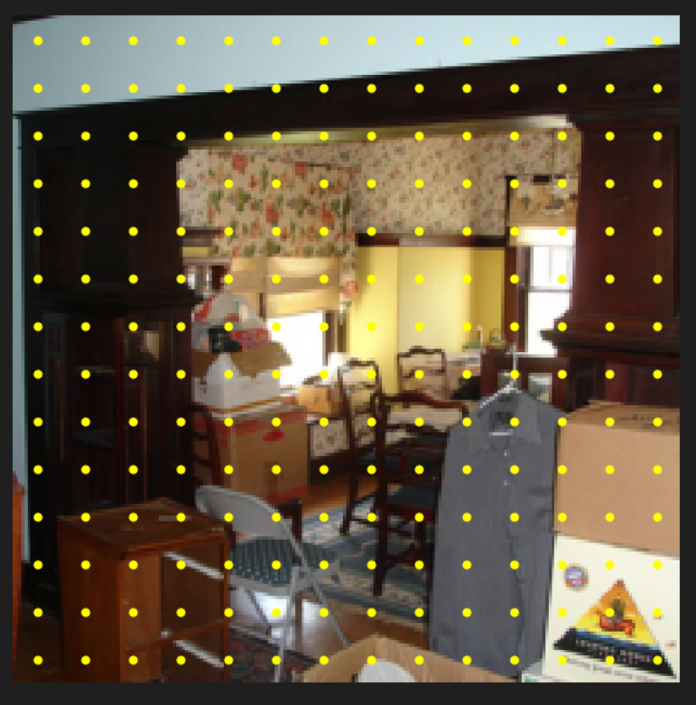
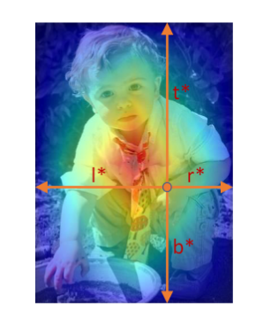

## FCOS
- 对于feature map的**每一个点**，都预测类别、中心点、gt box，所以不需要anchor；预测是通过CNN来预测的，所以可以方便的对每一个点都进行预测
- 对于每一个batch的gt_boxes（ground truth），会给出这个batch中图片中目标数量的最大值N，所以gt_boxes的size是(B,N,5)，其中N可能对于不同的batch是不同的，图片中目标数量小于N的会用-1填充
- 对于feature map的每一个像素点，都会匹配一个相对于原图的中心点（根据stride（即放缩比例）的大小，均匀地匹配上去）；比如原图是224x224，feature map是28x28，那么feature map的每一个像素点对应原图的8x8的区域，其中心点的坐标依次为(4,4),(4,12),(4,20),...,(4,220),(12,4),(12,12),...,(220,220)

- 这些中心点都是固定的，由于不同level的feature map的stride是固定的，这些中心点的位置也是固定的
- 对于每张图片，为不同feature map对应的中心点匹配gt box（ground truth），匹配规则是：
  - 如果此中心点位于某个gt box内，那么将其匹配到这个gt box；如果在多个gt box内，那么匹配到面积最小的那个gt box
  - 如果此中心点不在任何gt box内，那么将其匹配为background，对应gt box为(-1,-1,-1,-1,-1)
  - 要根据feature map的stride，候选的gt box并不是所有的gt box，而是匹配合适大小的gt box，因为还有上一级和下一级的feature map，上一级会匹配更大的gt box，下一级会匹配更小的gt box
- deltas：LTRB（left-top-right-bottom），根据中心点的坐标和bounding box的坐标计算出来的

- loss：对于每个像素点计算loss，然后求和，最后对正类个数（即不为背景）求平均
- 三种loss：
  - classification loss：计算类别的交叉熵损失
  - center-ness loss：计算预测的centerness和ground truth centerness之间的损失，只有正类才计算，背景不计算
  - regression loss：计算预测的deltas和ground truth deltas之间的损失（lab中使用的是L1损失），只有正类才计算，背景不计算
- 为何要搞个centerness：最后推理的时候，置信度是由类别概率和centerness相乘得到的；由于是对每个像素点都进行预测，所以势必会有许多重复的检测，而一些检测框可能质量比较低（即中心点非常偏离检测框的中心位置），这样centerness就会比较小，通过centerness可以过滤掉这些质量比较低的检测框