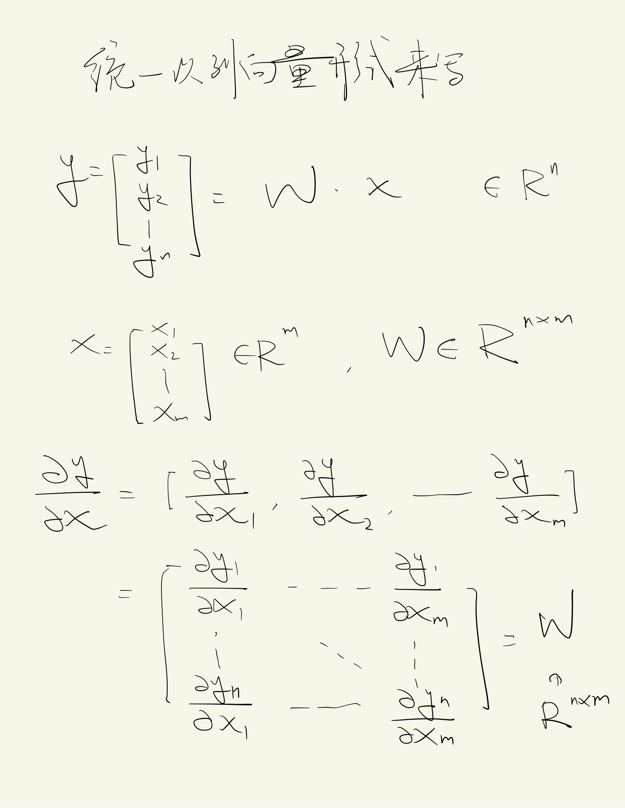
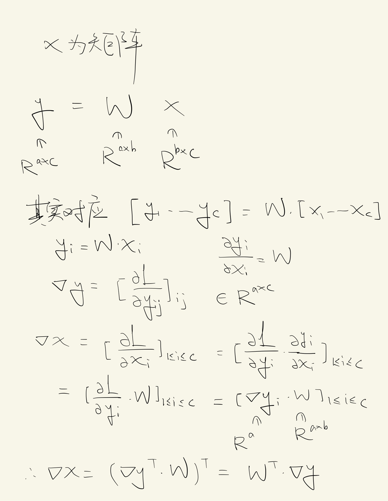
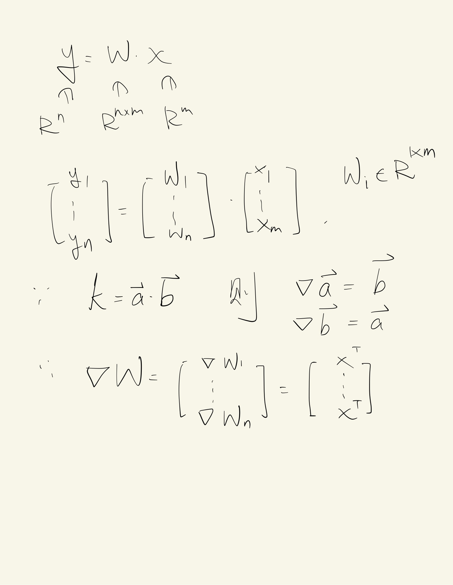
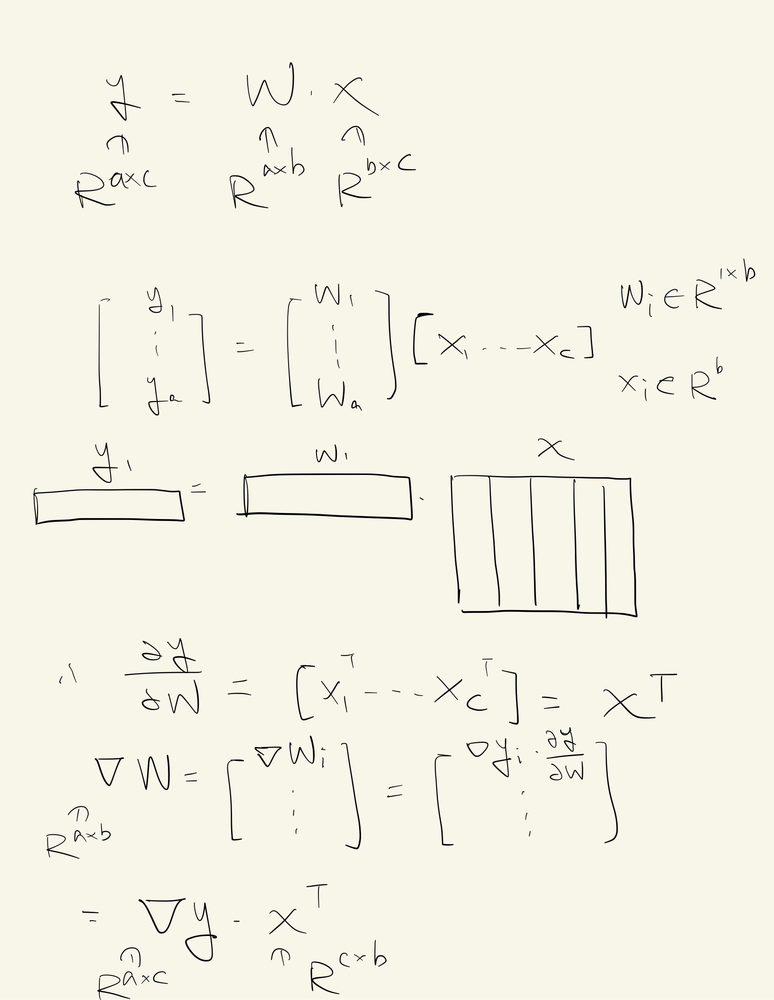
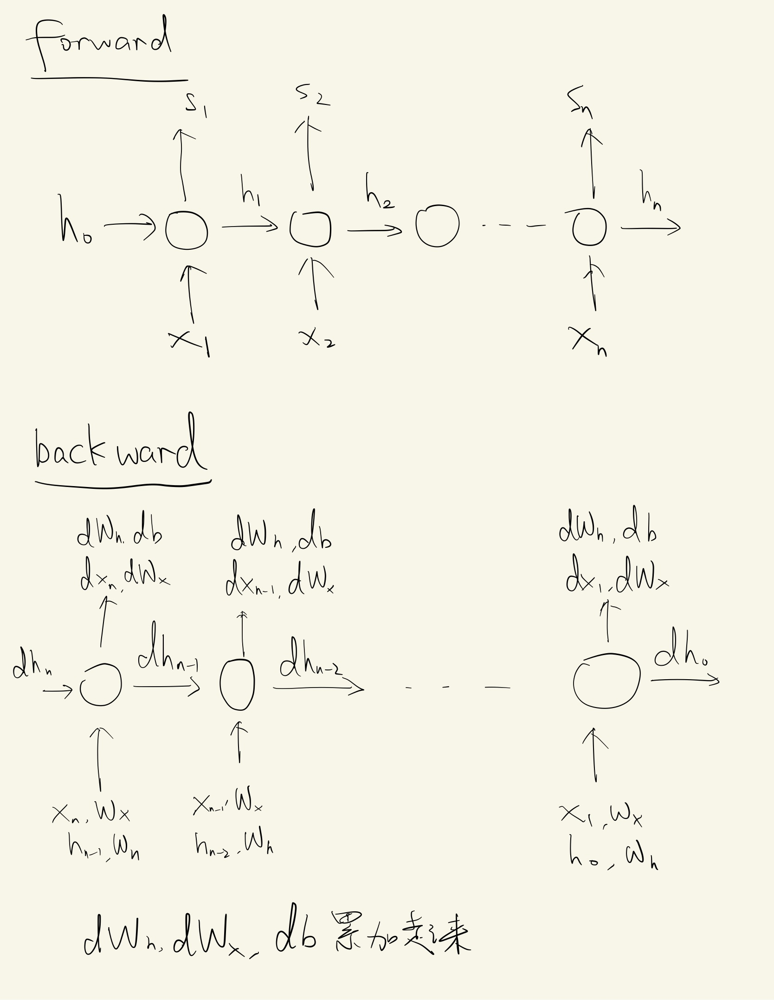
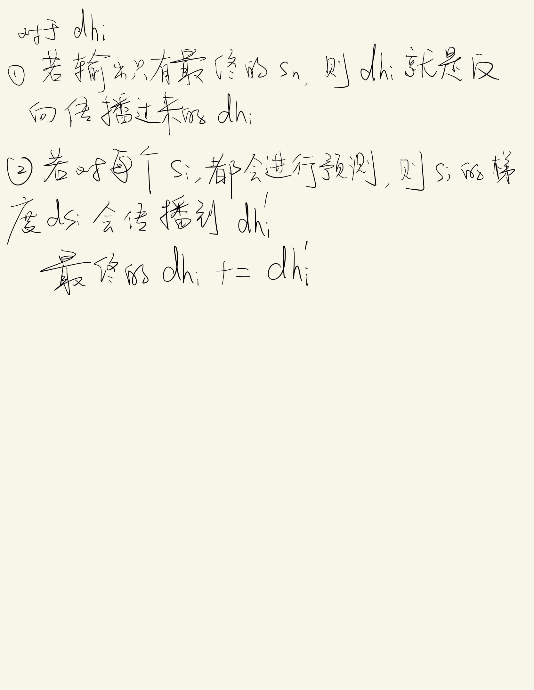

有关高维矩阵乘法反向传播的一些理解

## 反向传播
我们代码中写的`dw`，其实是`dL/dw`的意思（L为损失函数），意思是w变化一点，对损失函数有多大的影响

如果我们想让L变小，即朝着梯度的反方向走，那么我们就要让w减去`dL/dw`，即`w = w - dw`

对于高维的情况来说，L = f(y1,y2,y3,y4,...,yn)，那么我们其实需要计算L对(y1,y2,y3,y4,...,yn)的梯度，即▽(y1,y2,y3,y4,...,yn) = [∂L/∂y1,∂L/∂y2,∂L/∂y3,...,∂L/∂yn]

如果y1 = W * x，那么我们也希望计算▽x，方法就是用高维矩阵求导公式

> 本质上，我们对于一个变量x，就是希望计算它改变了一点，对损失函数有多大的影响，即∂L/∂x；如果这个变量是高维的，那就计算它的每个部分对损失函数的影响，即▽x
> 我们可以发现，L = f(y1,y2,y3,y4,...,yn)其实是高维空间曲面的方程，所以本质上我们是在对一个高维空间的参数化曲面找它的最优解，只不过我们无法通过数学方法直接求出来，所以只能通过梯度下降的方法来逼近

## 高维矩阵求导
### 向量求导法则
 

### 如果x为矩阵

### 对W求
 

## 对于偏置b的理解
y = x W + b，如果y ∈ R^(a * c) , W ∈ R^(b * c) , x ∈ R^(a * b) , b ∈ R^c

其实是对b进行广播之后，加到y上面去

我们用梯度下降的本质来理解，我们希望计算L对b的梯度，即∂L/∂b

假设b = (b1,b2,b3,...,bc)，那么b1变化一点点，会对y的a个元素造成影响，因为损失函数是求和的形式，所以会把这a个元素的影响加起来，即∂L/∂b1 = ∑(∂L/∂y1,∂L/∂y2,∂L/∂y3,...,∂L/∂ya)

所以∂L/∂b = (∂L/∂y).sum(dim=0)

## RNN
### BPTT
 

