<center><font size = 5>UMich EECS Notes</font></center>
<p align = 'right'>by Nemo</p>
<p align = 'right'>2023.8.24</p>

# L2 - Image Classification
> Evaluate on the test set only a single time, at the very end.
> Split your training set into training set and a validation set. Use validation set to tune all hyperparameters. At the end run a single time on the test set and report performance.
## image格式
Width * Height * 3个整数，其中每个整数范围是0~255，代表颜色；Width和Height为图片宽和高具有的像素点个数
## 挑战
1. 视点变化。对象的单个实例可以相对于相机以多种方式定向。
2. 规模变化。视觉类通常表现出其大小的变化（现实世界中的大小，而不仅仅是它们在图像中的范围）。
3. 变形。许多感兴趣的物体不是刚体，可以以极端方式变形。
4. 遮挡。感兴趣的对象可能会被遮挡。有时，只有对象的一小部分（只有几个像素）是可见的。
5. 照明条件。照明在像素级别上的影响是巨大的。
6. 背景混乱。感兴趣的对象可能会融入其环境，使其难以识别。
7. 类内差异。感兴趣的类别通常可以相对广泛，例如椅子。这些对象有许多不同类型的，每个对象都有自己的外观。

一个好的图像分类模型必须不变于所有这些变异的交叉乘积，同时保持对类间变异的敏感性。

## 图像分类管道
形式化如下：
- 输入：我们的输入由一组 N 个图像组成，每个图像都标有 K 个不同的类中的一个。我们将这些数据称为训练集。
- 学习：我们的任务是使用训练集来学习每个类的样子。我们将此步骤称为训练分类器或学习模型。
- 评估：最后，我们通过要求分类器预测一组以前从未见过的新图像的标签来评估分类器的质量。然后，我们将这些图像的真实标签与分类器预测的标签进行比较。直觉上，我们希望很多预测与真实答案（我们称之为基本事实）相匹配。

## 最近邻分类器
这些只是算法而非神经网络模型，它们不包含需要训练的神经网络，因此不需要训练时间  
### 方式1
直接把每个像素的RGB值相减，以此差值作为差别大小的判断依据(L1 distance)  
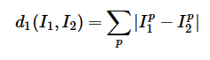
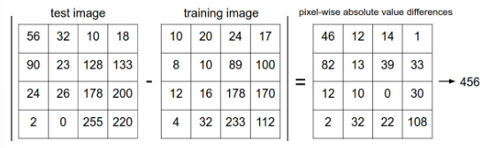
```python
import numpy as np

nn = NearestNeighbor() # create a Nearest Neighbor classifier class
nn.train(data, label) # train the classifier on the training images and labels
predict = nn.predict(test_data) # predict labels on the test images
# and now print the classification accuracy, which is the average number
# of examples that are correctly predicted (i.e. label matches)
print 'accuracy: %f' % (np.mean(predict == test_label) )
```

only achieves 38.6% accuracy on CIFAR-10 dataset
### method 2
L2 distance  
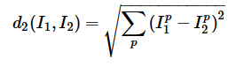
obtain 35.4% accuracy
### method 3
k-Nearest Neighbor Classifier(kNN)  
instead of finding the single closest image in the training set, we will find the top k closest images, and have them vote on the label of the test image.（比如选择这k个图片中出现次数最多的标签作为结果）  

## validation set
> 不要把test set用于超参数的修改，可以在training set中开一小块来完成此工作，这一小块称为validation set

## Cross-validation
//in common, training data : validation data : test data = 4 : 1 : 1  
比如把训练集分为5等分，4份用作training data，一份用作validation data  
Cross-validation：我们遍历5次，选择不同的1份作为validation data，然后把评估结果取平均值  
适用情况：
1. trainingset不大
2. 超参数不多

## kNN for universial approximation
如果训练样本趋于无穷，那么kNN可以拟合所有的数学函数  
如果你能将你的训练样本覆盖整个训练空间，那么kNN算法能够几乎完美地拟合出训练空间每个维度的近似真实函数  
那么，如果我们需要处理一个n维事物的分类任务，我们只需要使用kNN拟合出它在每一个维度的函数不就可以了吗？  
事实上这难以办到，因为即使是32*32的二维binary图像，它的训练空间大小为2^(32 * 32)，即总共有2^(32 * 32)中不同的二维binary图像，这约为10^308，这还是不考虑RGB值的情况

## kNN的局限性
K-Nearest Neighbor on raw pixels is seldom used
- Very slow at test time：kNN颠倒了训练时间和学习时间的一般关系，训练时间没有，但评估时间很长
- Distance metrics on pixels are not informative：即两个像素点之间的“距离”显得不是那么具有语义含义，因为图片可能受许多因素的影响（参考上面的“挑战”那一栏）

but nearest neighbor with ConvNet feature maybe works well!
## image classification dataset: 
MNIST, CIFAR10, CIFAR100, ImageNet, MIT Places, Omniglot

# L3 - Linear Classifier
## predictions are linear
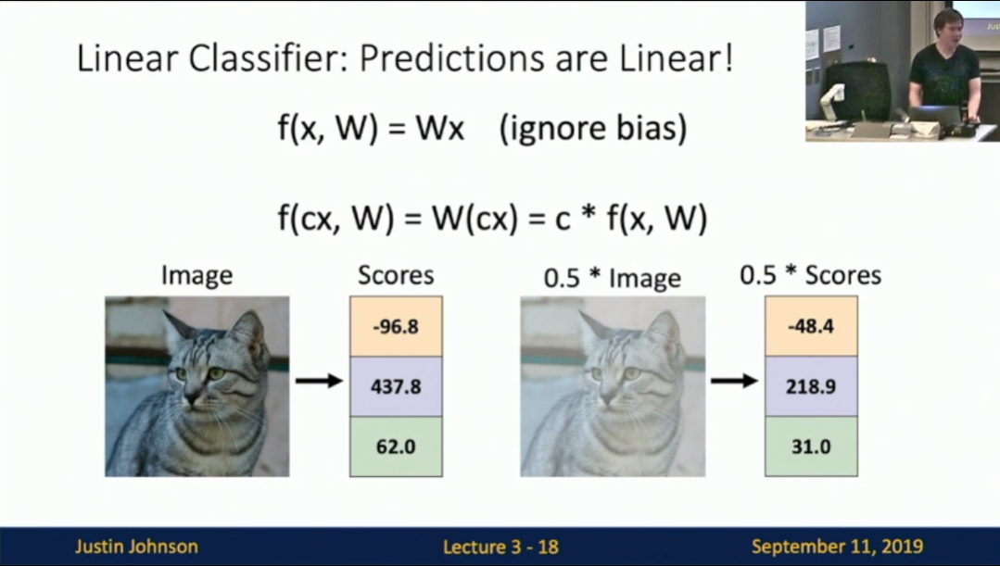

## linear classifier的线性代数理解
f(x,W) = W * x  
x为图像展成一个列向量  
可以看作W的每一行与展平的向量点积  
得到的结果正是对应某个类别的分数  
而我们知道：向量点积，如果不考虑大小的话，决定因素是向量之间的夹角（因为大小因素可以被抵消掉）  
所以可以把这一行看作是对应类别的特征向量，图像向量与它越“相似”，那么两向量的夹角就越小，对应的分数就会越高  
但这也是linear classifier的局限性，因为每个类别只能对应一个特征向量，倘若一个类别具有多种不同的形式，那么分类结果将会很糟糕  
更进一步，我们可以把这个特征向量reshape回原图像的形式，linear classifier正是要匹配与此图相似的图  

## linear classifier的几何理解
假设我们图像展成的向量有n维（即此列向量有n行）  
假设我们固定住其他值，只改变其中一个值，那么linear classifier的每一个类别对应的分数都会线性变化（这也可以通过矩阵求导得出来，导数是恒定的）  
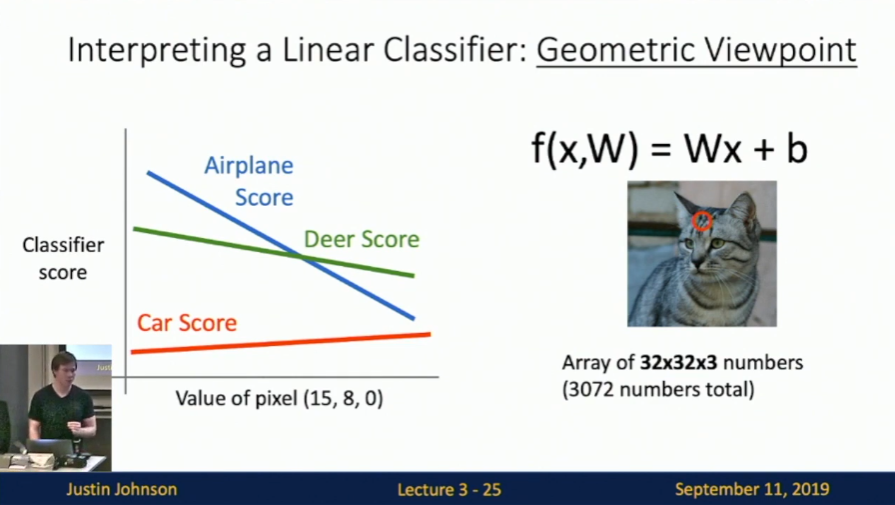
如果我们以图像向量的某一行为x轴，另外某一行为y轴，画出某一个类别对应分数为一个恒定值（图中为0，但只要恒定就行，此值值只会改变直线的斜率）时的(x,y)坐标点，这些点是可以连成一条直线的；我们从原点引一条与此直线正交的向量，此向量就指向了这一类别对应分数增大的方向；而且，如果我们把上面“线性代数理解”中的这一类别的特征向量投影到这个平面的话，刚好就是此向量！
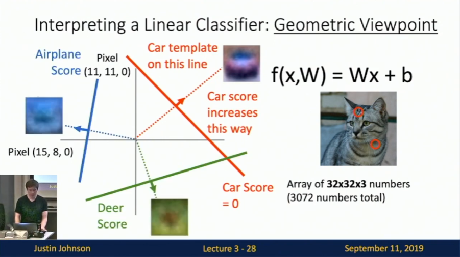
如果我们把此观点扩展到更高的维度：n维的图像向量，如果取定某个类别的分数，就可以得到这个n维空间的一个平面（这个类别的特征向量就是这个平面的法向量）  
由此观点，我们就知道了linear classifier不适用于那些情况
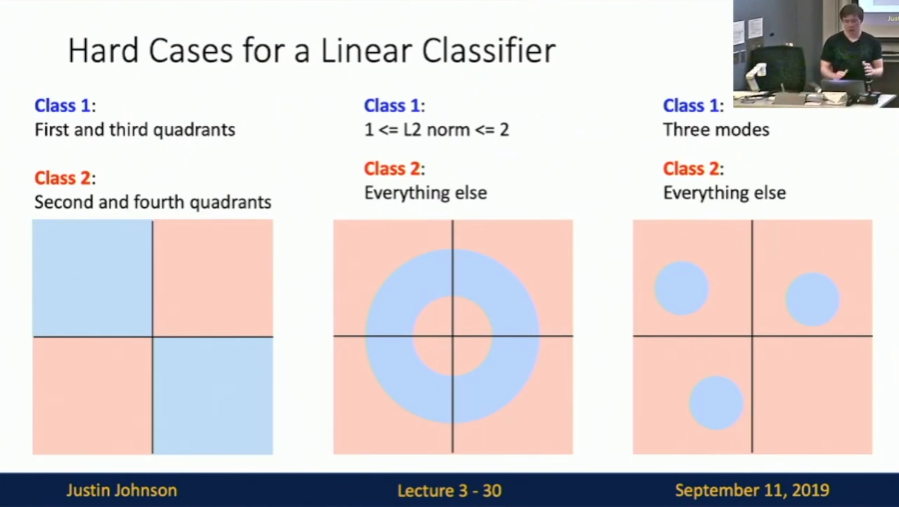
因为你无法画一条线把他们区分开


## SVM loss
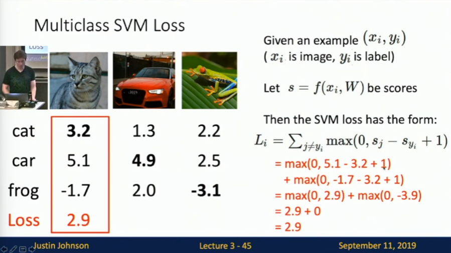
- 非常容易得到0损失
- 模型训练之初，将权重矩阵设为一个随机的很小的数值之后，我们期望看到的损失：C-1，C为类别数

## regularization

- 加入一些我们人为认知的知识到模型中
- 防止过拟合（防止对训练数据表现过好而泛化能力不行）。比如如果我们想要训练出来的权重矩阵更加的平均化一点，我们可以使用L2 Regularization；如果我们想要让权重矩阵集中一点，就可以使用L1 Regularization。这些选择是和我们人为的对数据的认知相关的
- 让模型简单化

## Cross-Entropy loss（交叉熵损失）
softmax function:
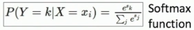
它可以让你的函数可微
Cross-Entropy loss:
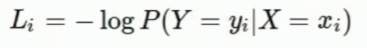
- 最大损失：+∞，最小损失：0，0损失非常难得到
- 模型训练之初，将权重矩阵设为一个随机的很小的数值之后，我们期望看到的损失：log(C)，C为类别数

# L4
## SGD
不取整个数据集来计算loss和gradient，而是取一个minibatch来计算loss和gradient，然后调整模型参数  
problem：
- 1
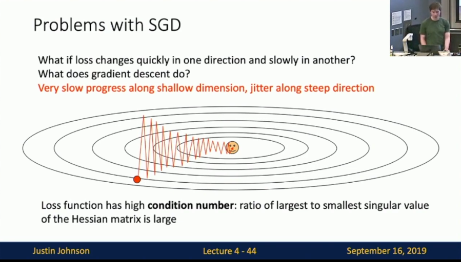
- 2：局部最优点
- 3：如果数据有噪点，那么可能minibatch里面取得是这些噪点，这对参数优化无帮助，所以模型可能在最优解附近盘旋

## SGD+Momentum
加入类似摩檫力的东西，随时间减缓模型学习率；加入速度，这记录了学习历史
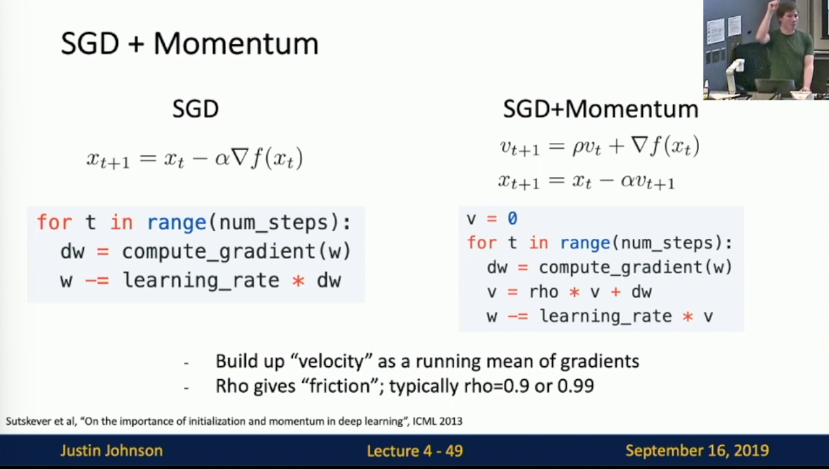
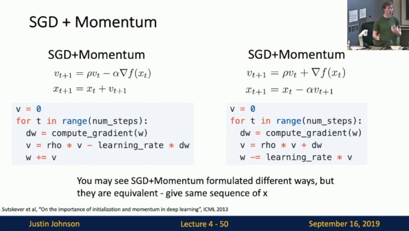
momentum优点：
- 可以消除噪点的影响
- 加速训练，因为加上了速度历史
正如momentum名字所示，它的理解可以和运动学结合起来
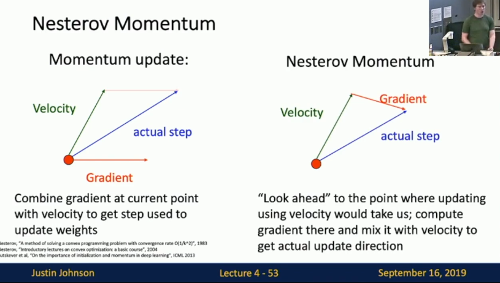
### nesterov momentum
传统momentum是“速度”和此时的梯度同时作用于参数调整，nesterov momentum是计算使用速度之后的梯度，以此进行调整，相当于前瞻性地调整
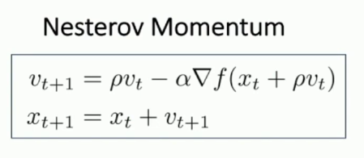

## adagrad
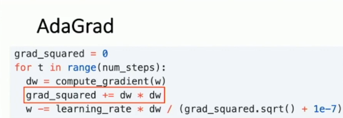

## RMSProp:"Leak AdaGrad"
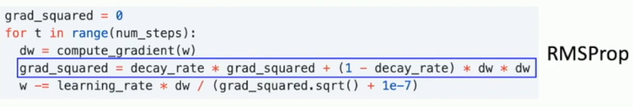

## Adam:RMSProp + Momentum
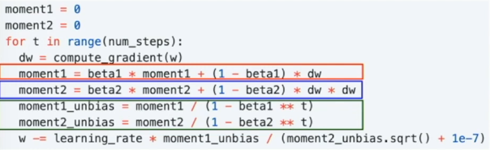
unbias是为了解决初始对w的调整过大的问题
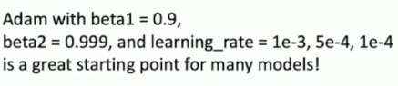

## 二阶优化器
求二阶导数  
但是可能需要更多的计算资源，往往是o(n^2)--->o(n^3)的区别，如果参数过多的话训练时间和资源是大问题

# L5
neutral network
## image feature
- color
- histogram of oriented gradients(HoG)
- data-driven features:
  - build codebook
  - encode images
  - find common "feature"
- concat different types of features
## fully-connected neural network / MLP
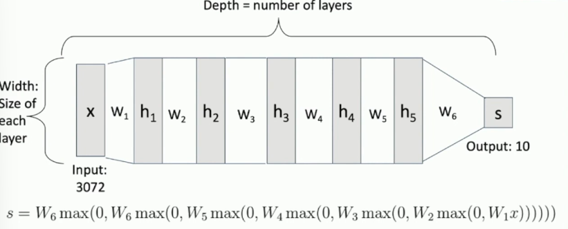

## 激活函数
如果没有激活函数，那么神经网络仍然是一个线性分类器，因为层次间仅仅通过一个权重矩阵相乘的话，所有权重矩阵可以合并为一个权重矩阵。
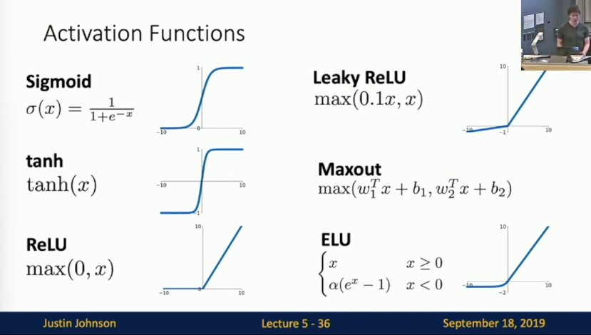
激活函数使线性的函数变为非线性，消除了线性分类器的局限性

### space warping
假设特征提取器是一个线性变换，如果没有激活函数，无论如何进行变换，还是避免不了线性分类器的局限性，因为线性变换套一层线性变换还是一个线性变换
我们把线性变换看作是一个坐标变换，比如如图所示的二维特征，对基向量进行线性变换，获得了新的一组基向量，也就相当于一个新的坐标轴。但如果没有激活函数（非线性），还是无法画一条直线区分两个类别  
但是，假设我们使用relu函数作为激活函数，它会把二维特征图上的点做一些非线性的变换，因此我们可以画一条直线把它们区分开。也可以理解为我们将线性分类器的“一条直线”变为非线性的“一条曲线”  
如果神经网络有更多层，那么分类器将可以表示为一个“形状奇怪的曲线”
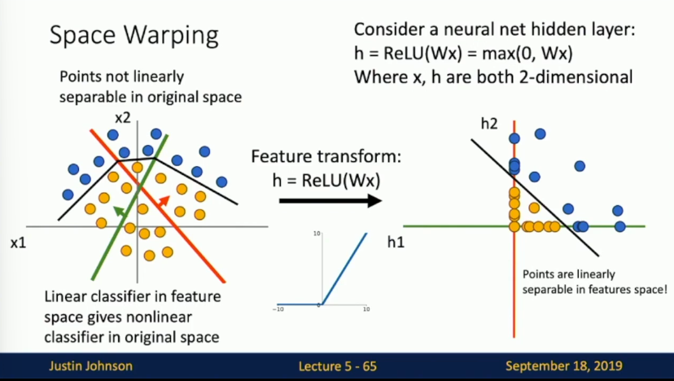

> Web demo with ConvNetJS: http://csstanford.edu/people/karpathy/convnetjs/demo/classify2d.html

## universial approximation
通过函数近似的思想，我们可以得到：mlp几乎可以拟合任意连续函数

## convex function：凸函数
如果loss function是凸函数，那么它是易于训练的，并且可证明是可以收敛的
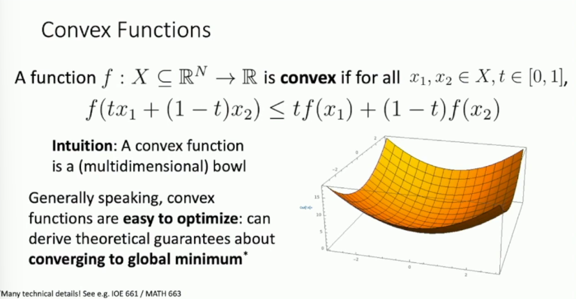

# L6
how to calculate gradient？
## 直接高位微积分矩阵求导
肯定不适合，因为
- 它要根据模型来进行调整，没有普适性
- 计算太复杂，且需要人力计算
- 公式复杂的话，计算量也会大
## Computational Graghs
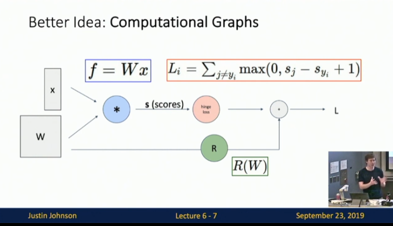
对于太大的模型，不适用，因为太难画出计算图了
## backpropagation
1. forward pass: compute outputs.
2. backward pass: compute derivatives. 从最后一层开始，一层一层向前推导。（对于每一层来说，只需要知道loss关于这一层输出的导数，就可以知道loss关于输入的导数，通过一个矩阵计算，而这一层的输入又和上一层的输出有关系，由此一层一层向前推导）

## patterns in Gradient Flow
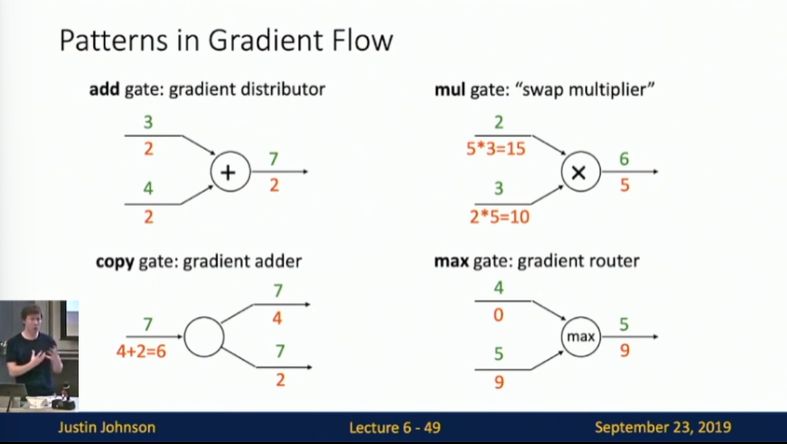

## backprop with vectors
### ReLU
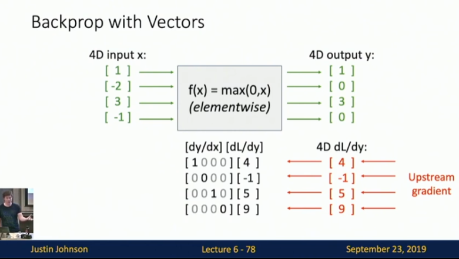
> 由于真实应用中的jacobi matrix会非常sparse，所以一般不会真正生成jacobi matrix，而是采取更加聪明且高效的方法计算

# L7
原先的线性分类器只能以一维的向量作为输入，意味着我们需要将图像展平为一个向量，但现在我们需要更关注输入图像的空间信息，希望分类器将其作为一个2D信息进行处理  

## Convolution layer(2D)
规范：D * W * H
深度，宽度，高度  
filter：深度必须与输入数据的深度相同(D * W0 * H0)  
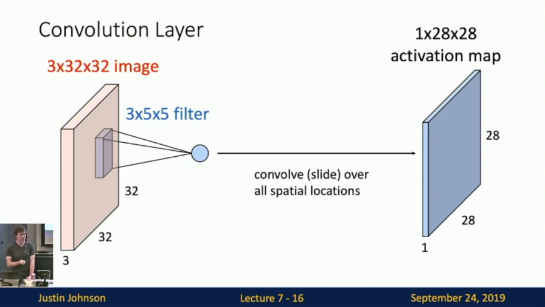
每个filter对输入进行卷积操作，产生1*(W-W0+1)*(H-H0+1)的输出  
卷积操作就是将filter作为一个窗口，对应位置的数字相乘，最后相加（其实如果拉成一个向量，就是内积，卷积操作也可以看作是比较filter和输入中某一块的相似度如何，再加上池化操作，就可以看作是寻找是否有一块和filter很像）   
如果有N个filter，那么产生N * (W-W0+1) * (H-H0+1)的输出，这个N就是新的深度  
我们写filter可以写：(N * D * W0 * H0)，代表N个(D * W0 * H0)的filter  
当然还有bias，是一个(N,)向量，为每个filter提供相同的bias
如果加上batch处理，那么规范形式将是：
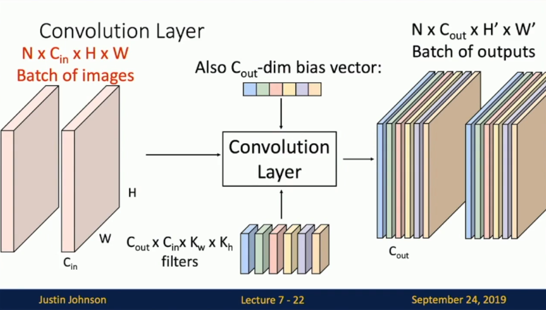

## 卷积神经网络
把卷积层堆叠起来
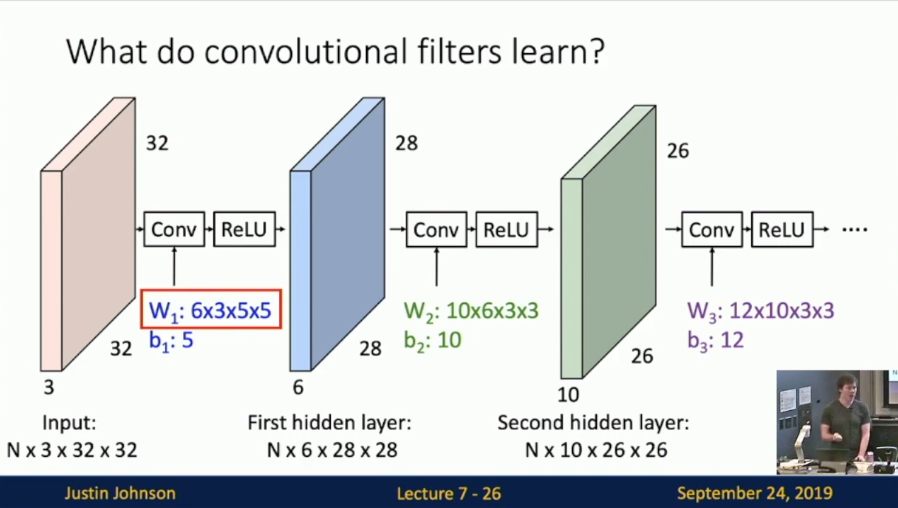

## padding
防止一个问题：进行一次卷积操作将会导致输入的宽和高减少些许的像素（宽减少W0-1，高减少H0-1），这将会限制卷积层的层数（因为更多的层会导致输入的宽和高变得越来越小）  
padding：在图片的外围填充一圈的0  
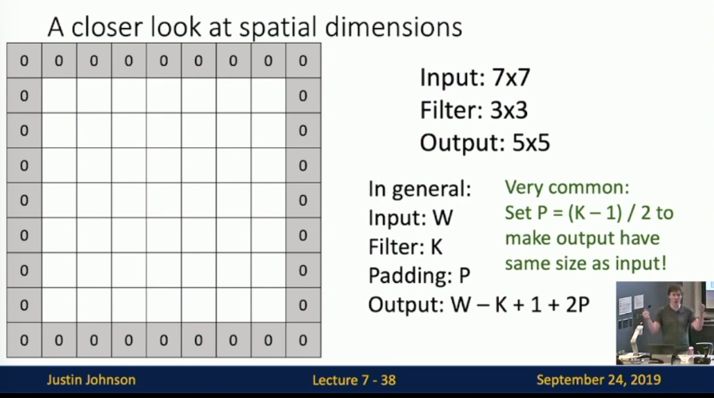 

## receptive field
大小是卷积核的大小(W0 * H0)  
receptive field可以叠加  
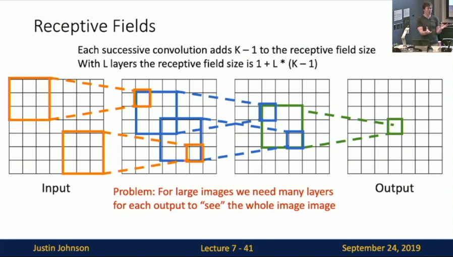

## stride
filter移动窗口的步长
output = (W - K + 2 * P) / S + 1  
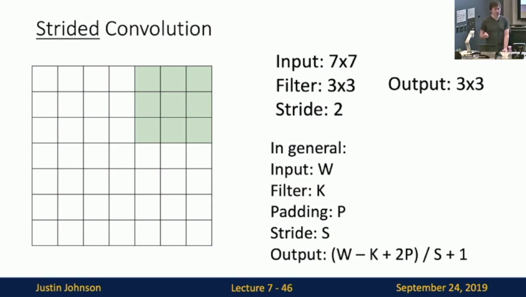

## 1*1 convolution
其实就是MLP，只不过权重和bias是共同的

## summary
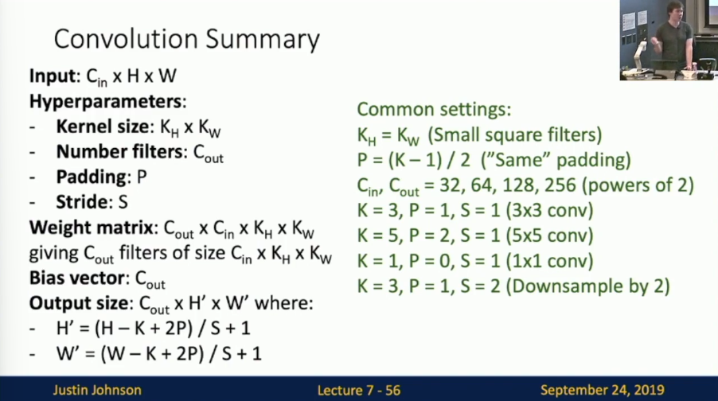

## 1D/3D convolution
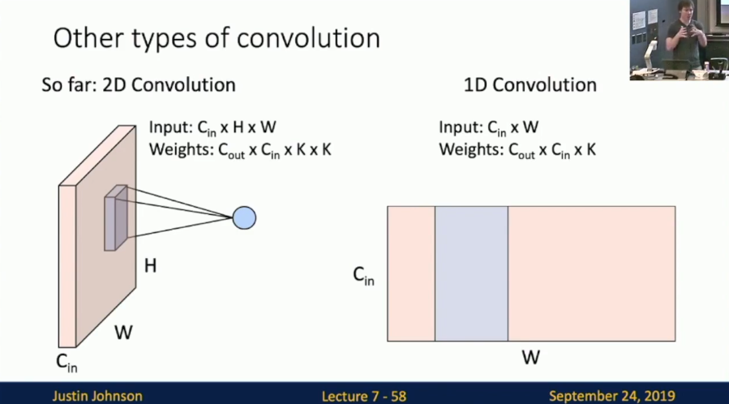
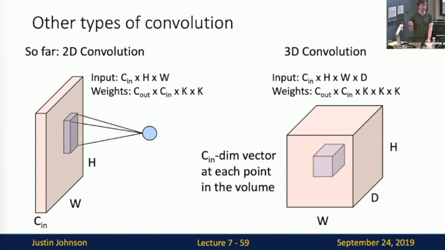

## pooling layer
没有需要学习的参数，只有算法  
是一种降维的方法
### maxpooling
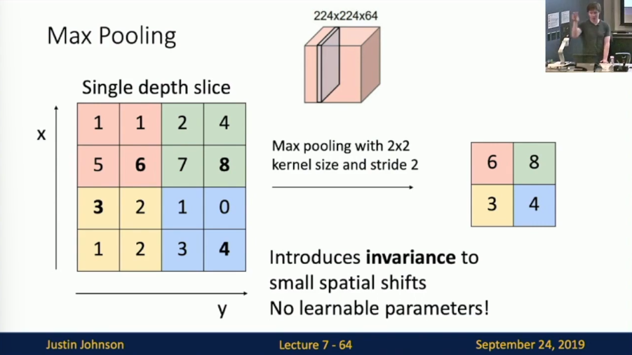
### avgpooling（平均池化）
把maxpooling的max函数换成avg函数

## 常见卷积神经网络的结构
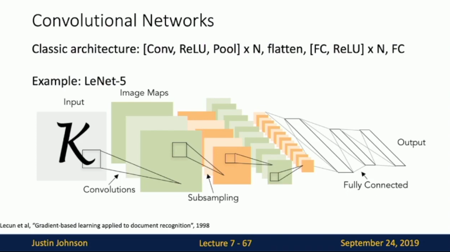

## normalization layer
作用：
- 稳定数据，使数据更平均化（处理之后数据的均值为0）；但是均值为0并不是一直都是好的，所以我们可以添加两个可学习的参数来抵消它的影响
- 添加一个非线性函数，让模型拟合效果更好（类似ReLU的作用）
- 可能的好处：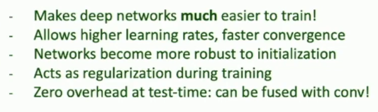
most common: batch normalization  
对每个batch的数据进行归一化处理
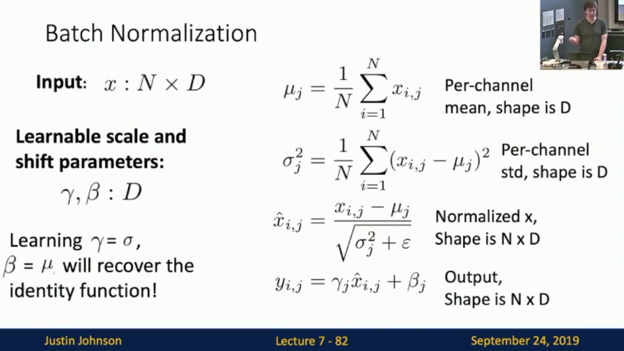
batch-normalization带来的问题：  
让batch中的数据彼此产生联系了。以前每个batch中数据互不关联，其实可以看作是每个数据被独立处理。但是现在每个batch中数据有联系，可能会导致一些问题：比如test set中一个数据可能因为这个batch中的其他数据的缘故而效果变差，假如数据由用户上传到web服务器，那么你上传同一个数据获得的准确率还取决于谁和你同一时间上传数据，这就比较扯了。  
解决方法，在test的时候我们把μ和σ取为常量，比如训练中μ和σ各自的均值，这样数据间的独立性再次获得保证  
但这也可能产生新的问题：因为训练和测试网络不一样了，所以保不准会出奇怪的bug

## batchnormalization for ConvNet
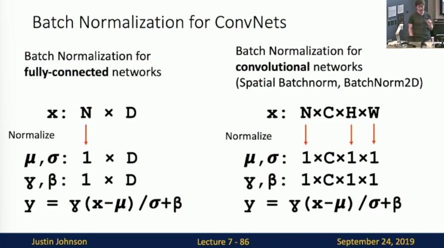

## layer normalization
normalize数据的另一个维度（不是batch的维度）  
训练和测试保持一致
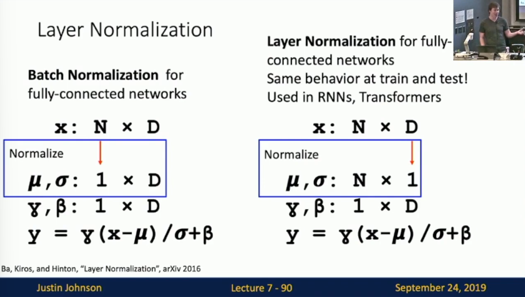

## instance normalization
normalize数据的H和W维度  
训练和测试保持一致
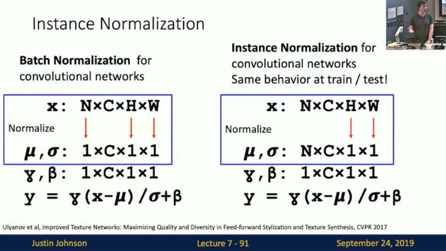

# L8
## AlexNet
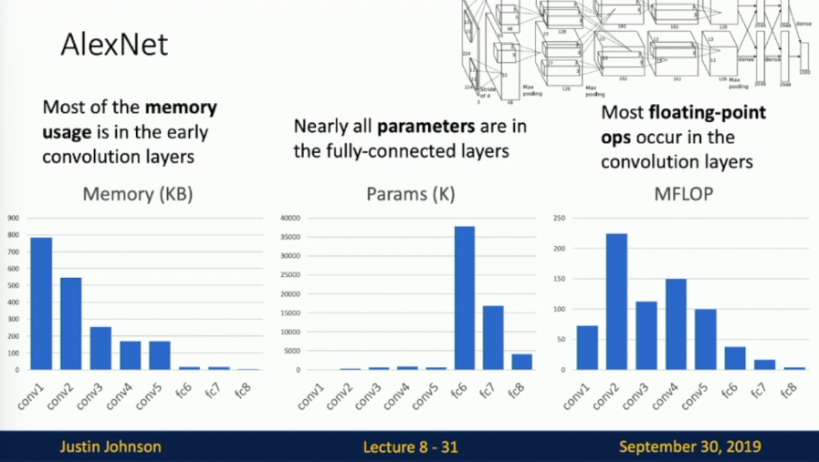
卷积层内存空间用的多、计算量大，而参数数量少；全连接层则相反  
## vgg结构
VGG Design rules:
- All conv are 3x3 stride 1 pad 1
- All max pool are 2x2 stride 2
- After pool, double #channels

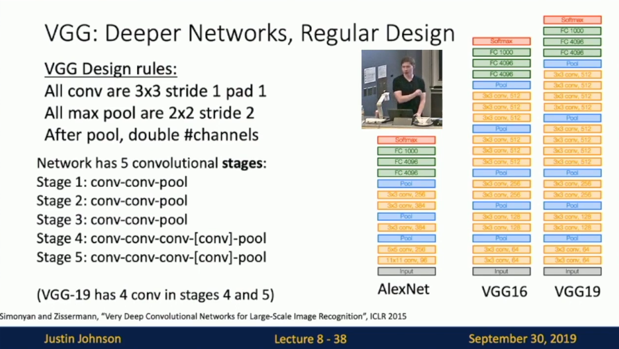
为何这么选择：  
考虑receptive field，一个5 * 5的卷积核的receptive field和两个3 * 3的卷积核的receptive field是一样的，而后者的计算量和参数量要少很多（忽略激活函数和pooling层，因为它们的计算代价很小，参数量为0）  
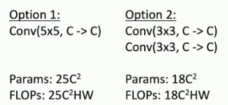

## GoogleNet
### stem network
在网络的最开始阶段，使用卷积层和pooling层对数据进行降维。这大大降低了之后的计算代价
### inception module
并行的分支，把kenerl size的每种情况（对应超参数的每种选择）在每个分支遍历一遍，这样就不用考虑超参数的选择了
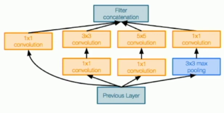  
### repeated structure
重复的模块贯穿整个网络
### 1*1 conv
用于降维
### global avgpooling
no FC layer, instead using global average pooling  
消除了大量需要学习的参数  
可能因为google是想把它投入实践，所以需要高效一点
### auxiliary classifier
辅助分类器，在中间几层加入分类器，也计算损失和gradient，也对网络的参数反向传播  
为了让网络参数训练更快，而且收敛
### ResNet
Residual Networks残差网络  
vgg和googlenet都有很高的层数  
intro：56层的网络比20层的网络性能更差，无论在训练集上还是在测试集上，这十分反常识；这说明深层模型的模仿能力不行，因为即使是模仿20层的网络，也至少可以做到一样好；如果优化了深层模型的模仿能力，说不定能提高它的表现效果    
残差网络优化了这一点
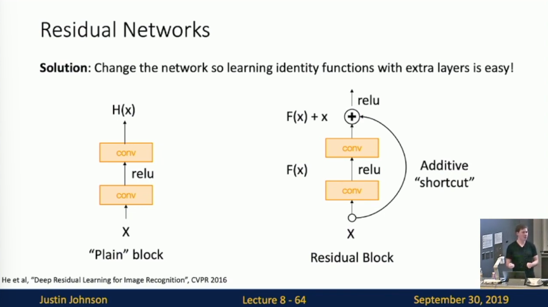
residual block把卷积（+relu）之后的值和原值相加  
如果设置权重参数全为0，那么输出就是原值  
ResNet就是residual network的堆叠  
也使用了stem network和global avgpooling  
bottleneck block：  
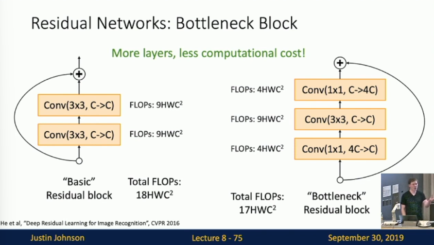
更少的计算，但是更高的非线性  
优化了模仿能力之后，再加上使用bottleneck block使计算减少，我们可以大胆地加深网络层数（同时使用更多的bottleneck block让计算量维持相对稳定）

## ResNeXt
inception module + ResNet
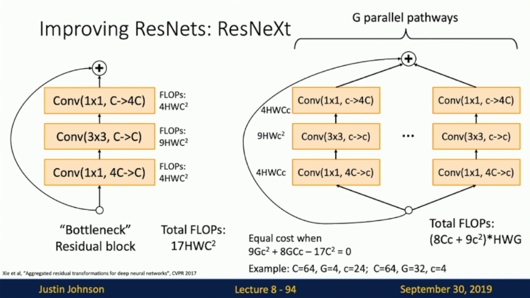

## group convolution
把channel拆成k个组，每个组用一个单独的kernel进行卷积  
可以有效减少计算量
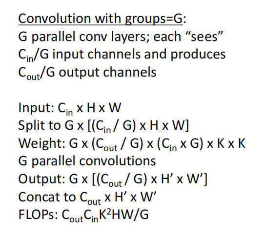

## densely connected neural network
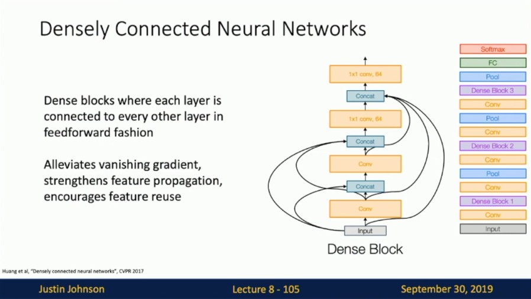
resnet把+换成concat

## MobileNet
更轻量的网络  
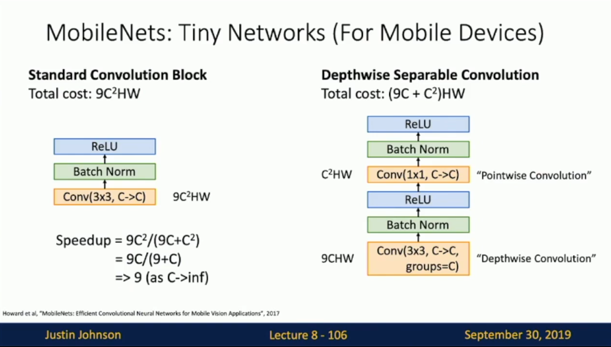

# L9
## cpu和gpu
gpu是计算特化的  
gpu有更多的计算单元，并且有关于矩阵乘法的特殊优化（其存储单元的形式支持了这一点）  

## pytorch autograd
在正向传递的时候，如果检测到变量设置了autograd=True，那么会在后台自动生成计算图（每次正向传递都会生成计算图，每次计算图被用完会被丢弃）
> 计算图每次都会生成的好处利于有不同的计算路线的情况，如果只有确定的计算路线，可以使用静态计算图  
> 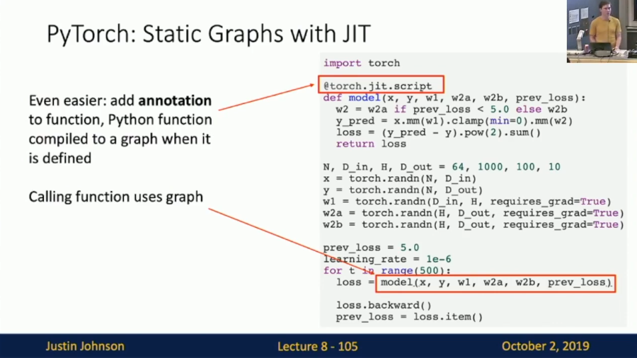
> 静态计算图的好处：节省算力；方便移植到其他平台（因为可以不用依赖python的库在运行时生成计算图，而只需将静态计算图和模型一并导出，为静态计算图写一个api即可）  
> 缺点：不方便调试；不适用于计算图会变化的情况（比如一些模型的结构与输入是有关联的）
在loss.backword()的时候，会依据此计算图，自动计算grad  
注意：grad会累加的，所以每次进行梯度下降操作之后，要调用grad.zero_()来清楚grad；手写梯度下降的时候要在torch.no_grad()块下使用梯度下降，保证不生成计算图  
尽量使用封装好的函数，因为如果你使用自己写的函数可能会导致生成额外的计算图和检查点
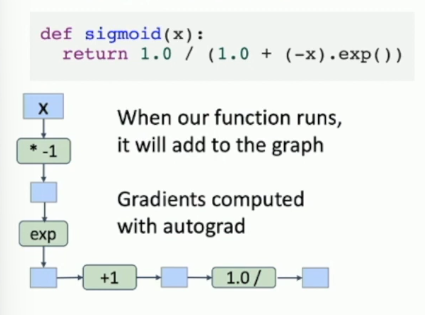
这种情况会在每一步生成检查点和计算图  
你也能自己定义backword()函数，用这个方法来优化上面的sigmoid函数  
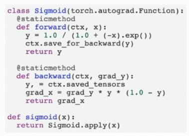
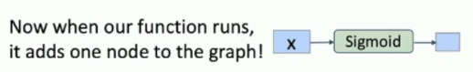

# L10
## activation functions
### sigmoid
range [0,1]，便于表示概率  
但是，问题  
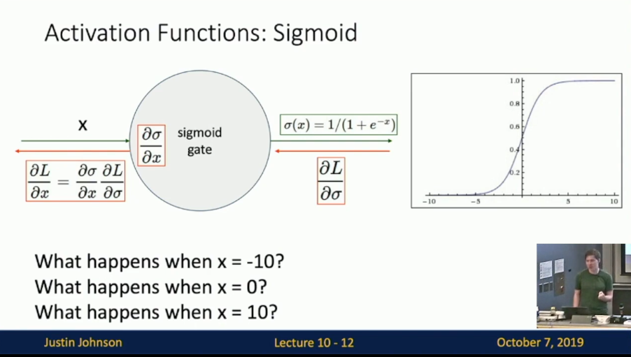
- 不是以0为中心的
- 当x过小或者过大的时候，σ关于x的偏导就会过小，导致L关于x的偏导过小，x的改变对于L将会产生非常细微的影响，那么整个学习过程就“死”了  
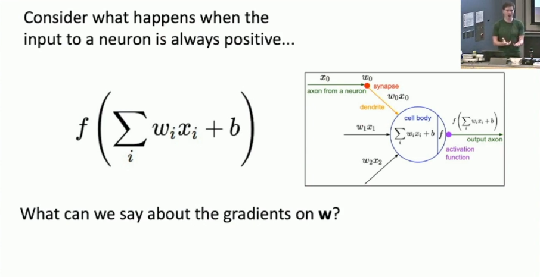
- sigmoid永远是正的。所以当我们计算关于w的偏导时（上图），x永远是正的（因为经过了sigmoid），那么正负就取决于L关于f的偏导，这是不合理的：想象我们最理想的参数矩阵（这并不由训练过程决定），它的元素可能是正负交替的，但是我们的参数矩阵在学习的过程中只能向同时增大或者同时减小的方向前进，这会导致学习过程走一个曲折的折线，这种情况在维度更高的情况下会变得更糟
  - 但是batchnormalization can help：经过batchnormalization，x就不会恒为正，而是正负交替
- exp()计算代价比较大（但是这个计算代价在gpu中不大）

### tanh
- 以0为中心
- x过大或者过小的时候，σ关于x的偏导就会过小，导致L关于x的偏导过小，x的改变对于L将会产生非常细微的影响，那么整个学习过程就“死”了

### relu
- cheap
- 不以0为中心
- relu也永远为正
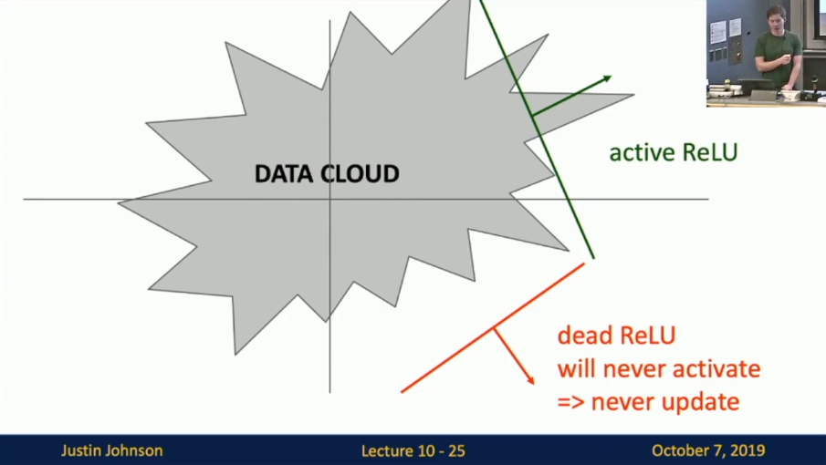
- 当一个样本点中所有值比0小的时候，relu的为0，之后所有计算都为0。这个样本点对参数没有带来任何改变，是个“废”样本点

### relu改进版
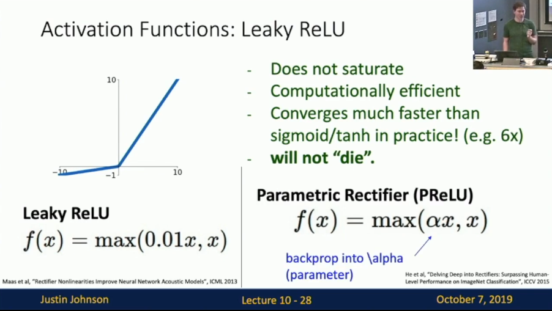
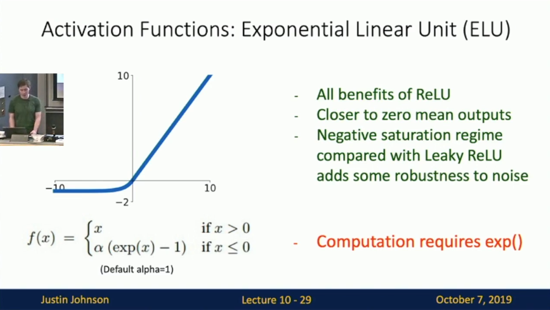
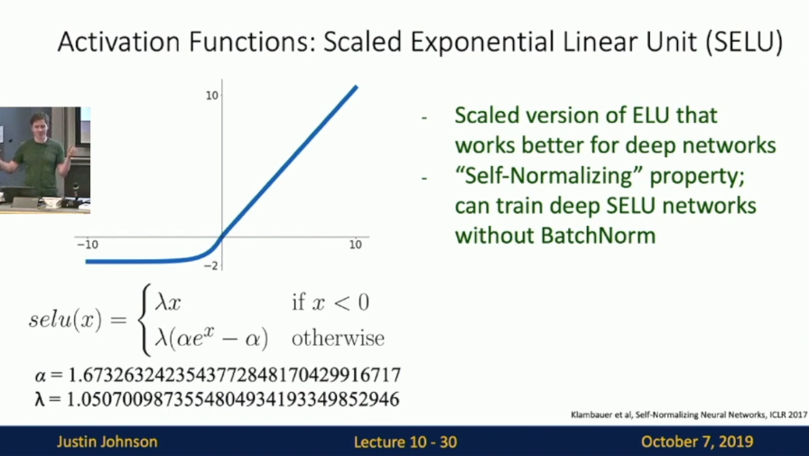
但是实际情况下这些都差不多

### 实际使用
建议relu，不建议sigmoid和tanh

## data preprocessing
### normalization
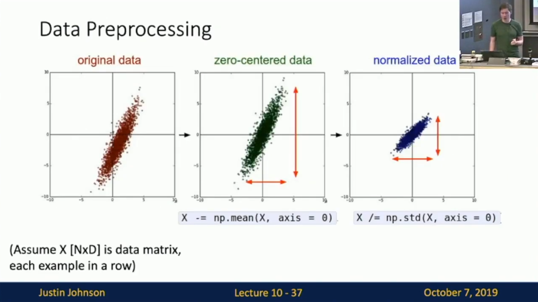
normalization 可以解决上面sigmoid和relu的问题：梯度永远为正或者为负  
### PCA / Whitening
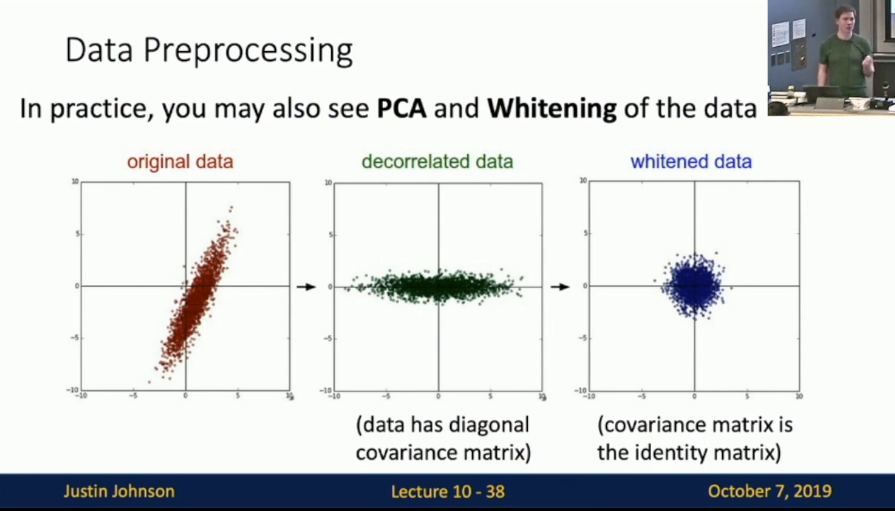
### benefit of data preprocessing
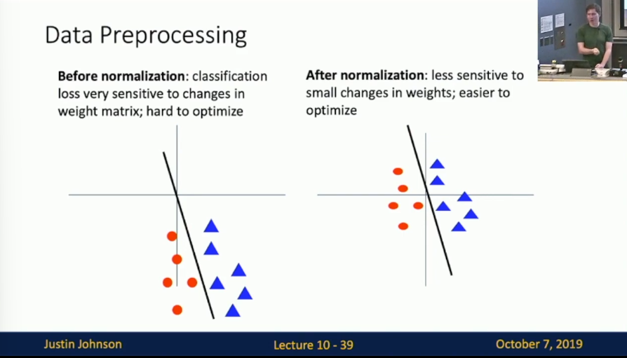
对权重的细小改变更加的不敏感：举线性分类器作为例子，因为权重矩阵的初始值往往是在0附近的随机的、比较小的值，线性分类器趋向于距离原点比较近，如果数据样点都距离原点比较远，那么参数的微小改变可能导致分类结果的巨大变化，但是经过data preprocessing之后数据样点都在原点附近，对参数的微小改变就没那么敏感

## weight initialization
采用tanh作为激活函数进行测试
### 全部置为0 
显然不行，这样输出全是0，而且梯度也全是0，根本学不了
### 小随机值
对于小网络可以这么做  
对于大网络，随着网络层数的深入，数据值将越来越趋向于0，同样梯度也会非常小，还是学不了
### 大随机值
x的值要么很小要么很大，经过tanh激活之后会分布于-1，1两端，梯度还是0（tanh在x很小或很大时导数接近0）
### xavier initialization
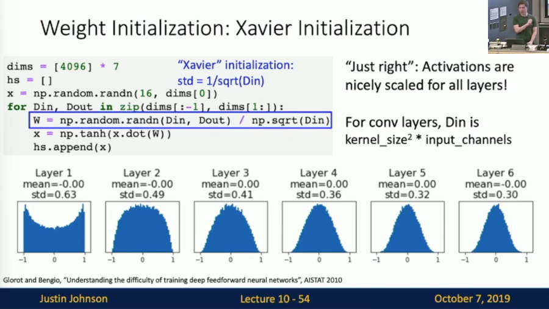
标准值是sqrt(输入通道的数量)
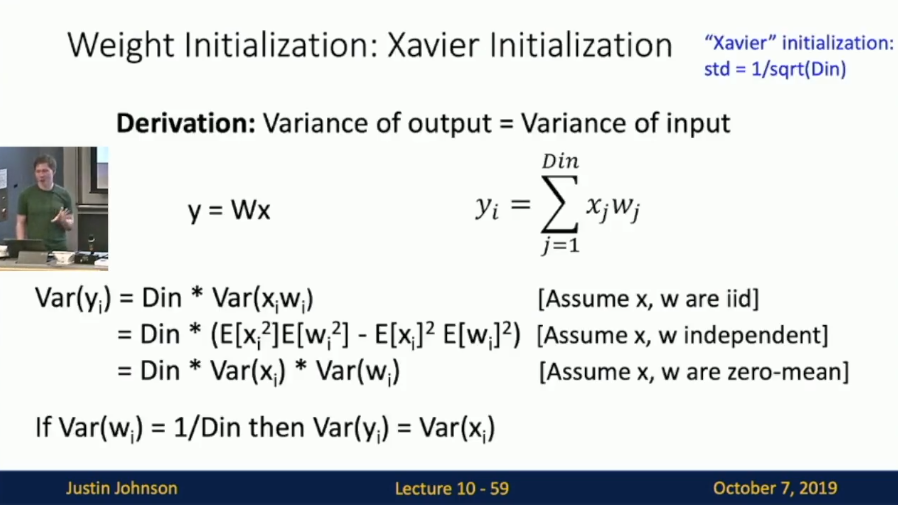
经过理论分析，当我们采用此种方式初始化权重矩阵，那么矩阵运算前后变量的偏差值是相同的
### relu的情况
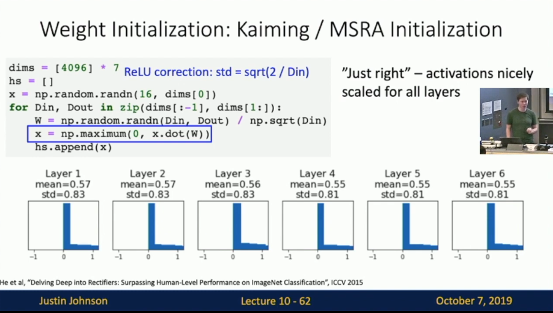
MSRA initialization：将标准值设为2/sqrt(Din)  
2是为了弥补relu将接近一半的小于0的值设为0的代价

## dropout
在每一层随机去除一些neuron（把它们的值置为0）  
理解：
- 一个单元可能学习特定的特征，去除某些单元后如果神经网络仍然能学习的很好，说明神经网络很robust  
- 每次学习的实际是神经网络的一个子网络

在test的时候：
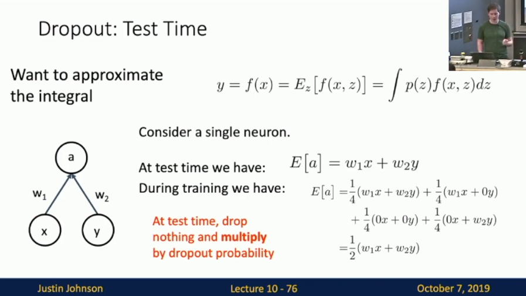
我们可以计算期望知道：在每个结果上乘以一个dropout的常数即可让神经网络和训练时期的神经网络相近，这称为rescale

### inverted droppout
在训练的过程中rescale，即dropout了多少比例，最后结果就乘以这个比例的倒数  
这样在test的时候就不用rescale了

## 数据增强 data augmentation
比如在原始数据上transform、scale、crop等等  
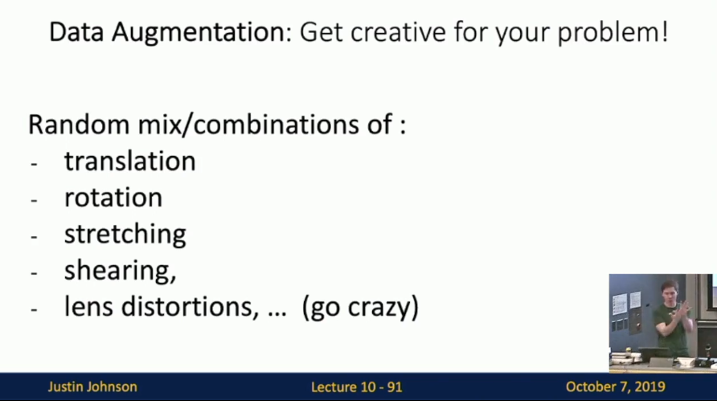

## 其他增加随机性的办法
### dropconnect
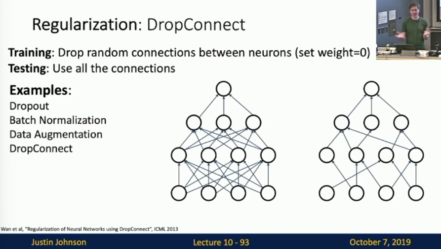

### fractional pooling
池化的区域是随机的
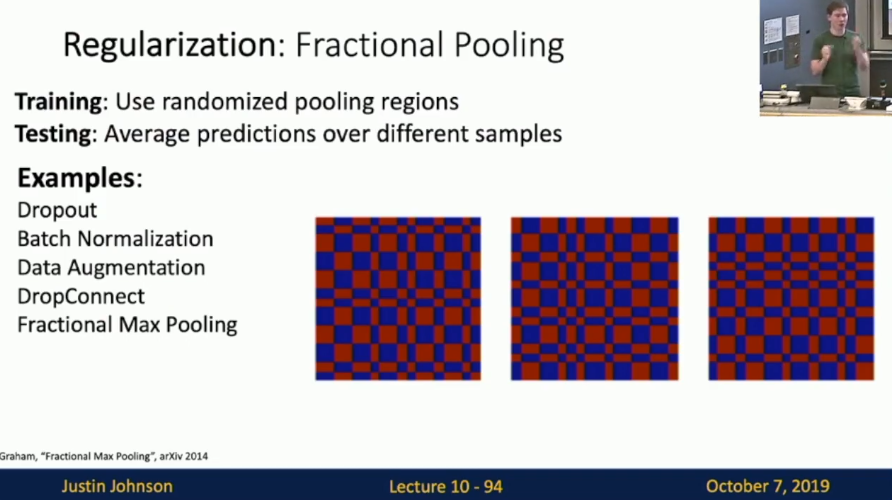

### stochastic depth
drop模块
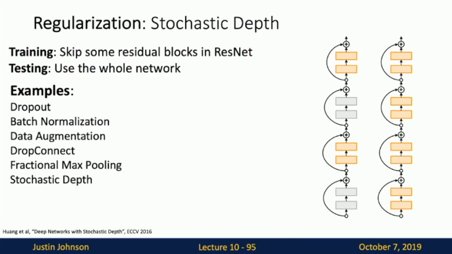
drop数据
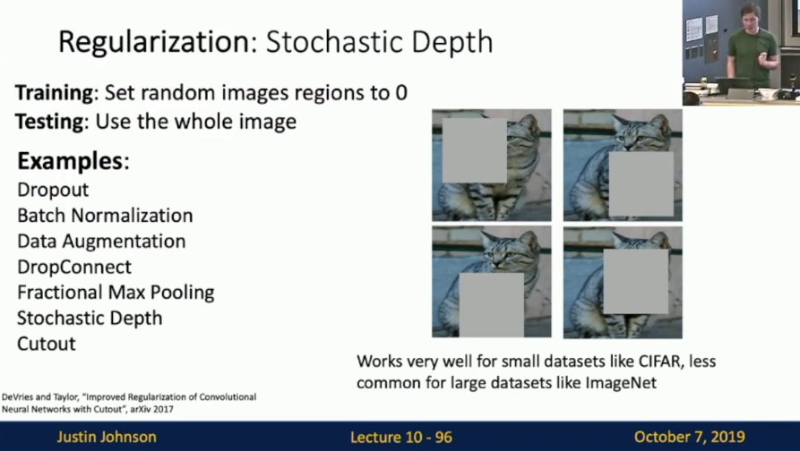

## mixup
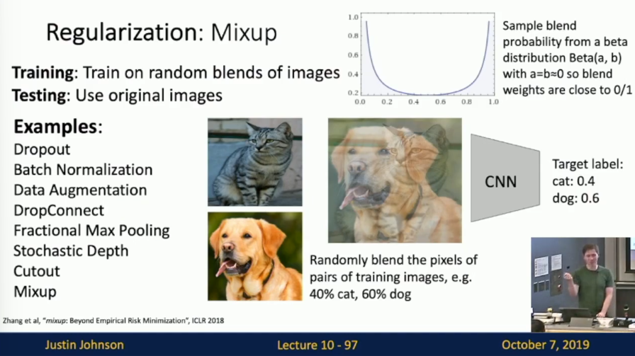

## 随机性
- dropout
- batch normalization
- data augmentation

# L11
## 学习率调整
学习率是最重要的超参数之一

不同学习率的loss曲线：
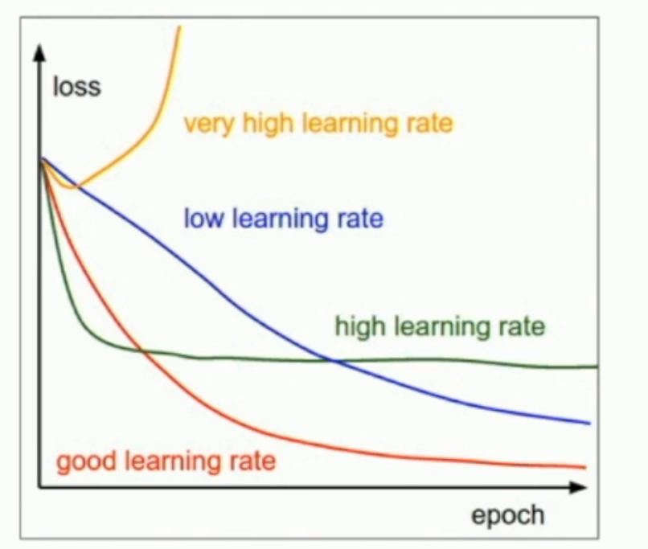

由于往往不能一次就找到最好的学习率，所以我们需要调整学习率，常见的作法是从高学习率开始，然后逐步减小学习率

### step decay
每过一定步数的学习，就调整学习率

例如，ResNet的学习率调整：每过30个epoch，学习率减小10倍

> 启发式训练方法：为了找到选择多长的步数，会先在高学习率下训练一段时间，然后观察loss曲线，找到一个loss曲线的“拐点”，这个拐点的epoch数就是一个合适的步数

### cosine learning rate schedule
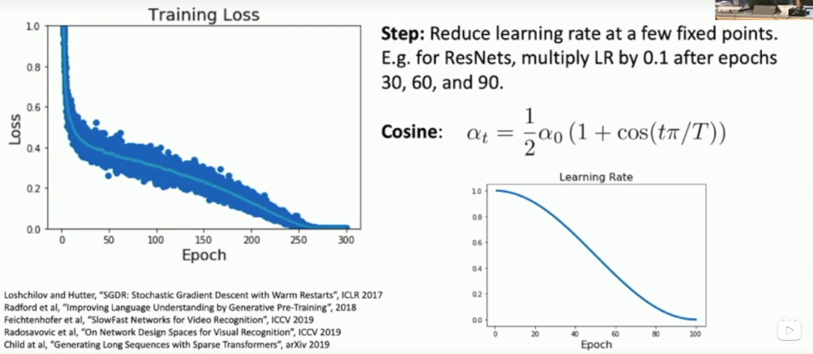

cos学习率调整的有点：
- 超参数少：只要初始学习率α0和多久降到最小学习率的时间T，但通常T就是整个训练的epoch数，所以真正需要我们设定的超参数只有一个：初始学习率α0

### linear learning rate schedule
线性下降学习率，从初始学习率线性下降到0，也通常是每个epoch下降相同的值

### 倒数平方根学习率调整，常数学习率
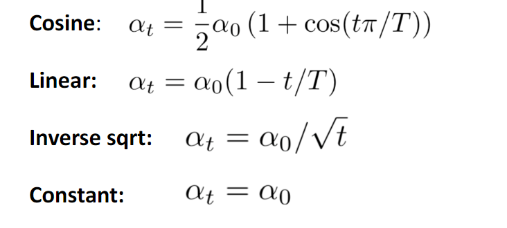

## how long to train
### early stopping
当你的验证集的loss上升或者训练了太长时间的时候，就停止训练

但是要注意要保存最好的模型

## 超参数选择
### grid search
网格搜索

sklearn中的GridSearchCV

### random search
随机搜索

选择一系列的超参数，然后随机选择一组超参数进行训练，然后选择效果最好的超参数；通常也可以选择超参数在一个范围内

### 如何选择
在训练模型之前，你很可能不知道哪个超参数更加的重要，如果使用grid search，那么你可能会浪费很多时间在不重要的超参数上；而且，往往网格搜索的密度不如随机搜索（随机搜索可以搜索一个范围，而网格搜索往往只有少量的数据点），所以在已知信息很少的时候往往随机搜索更加合适

### 选择步骤
1. 查看初始的loss
2. 尝试过拟合一个小的数据集，让其准确率达到100%，这样你就知道你的模型是可以学习的，如果你的模型在小数据集上都学不了，那么在大数据集上也学不了
3. 使用你的模型，使用所有训练数据，寻找合适的学习率，让loss能够以一个合适的速度下降
4. 稀疏的网格搜索，训练1~5个epoch
5. 选择合适的超参数，然后训练更长的时间（10~20 epoch），关闭学习率调整
6. 观察loss曲线，分析
7. goto step 5

#### loss曲线的分析
bad initialization:
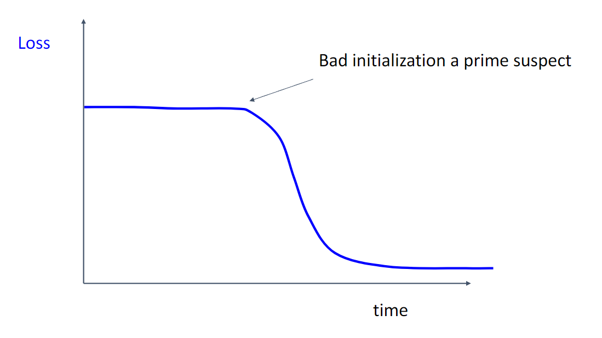

learning rate too high:
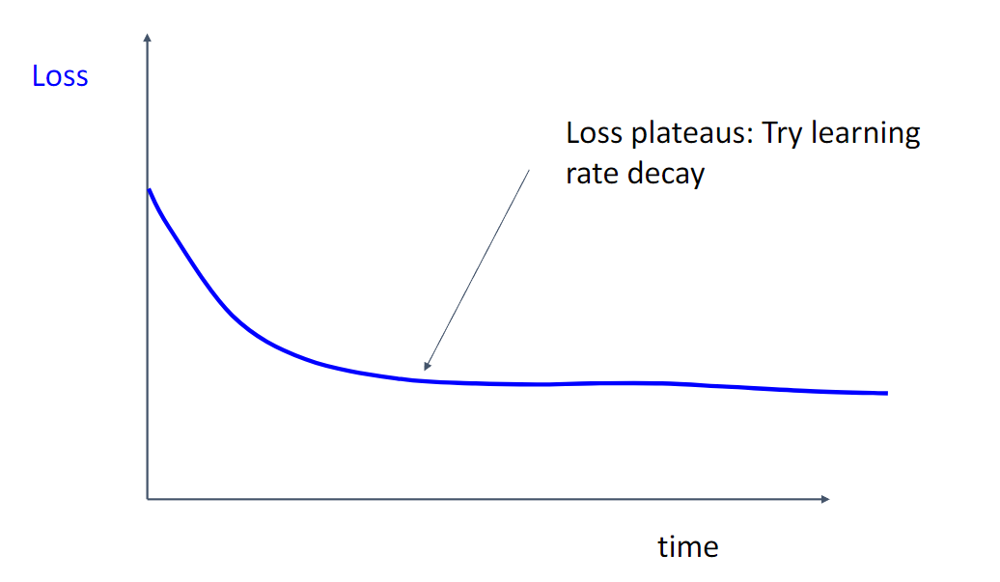

learning rate too early:
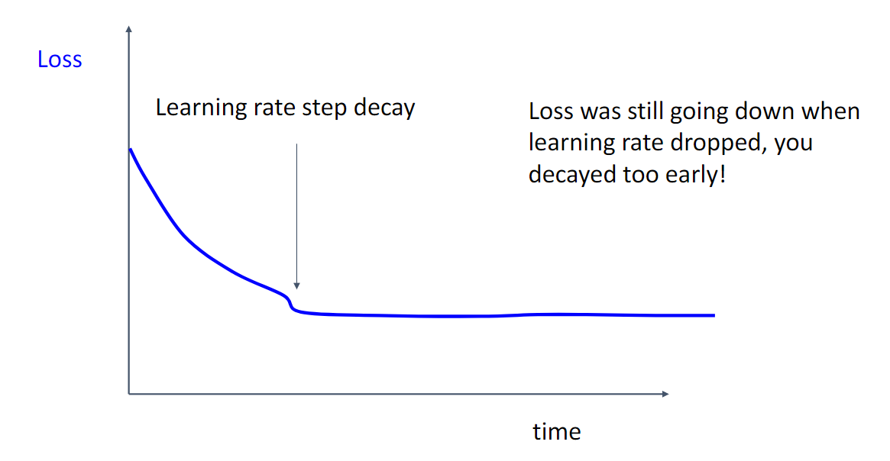

#### 准确率曲线的分析
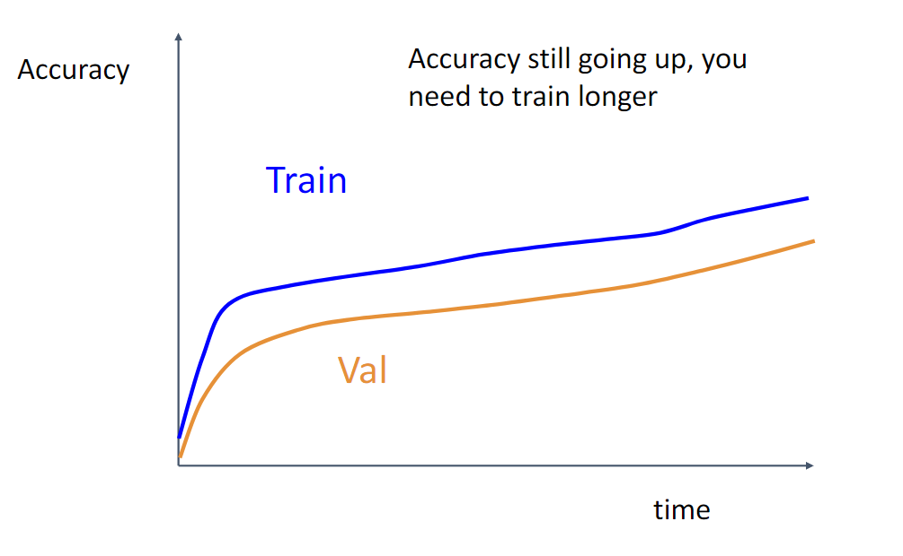
nice，只需要训练更长时间

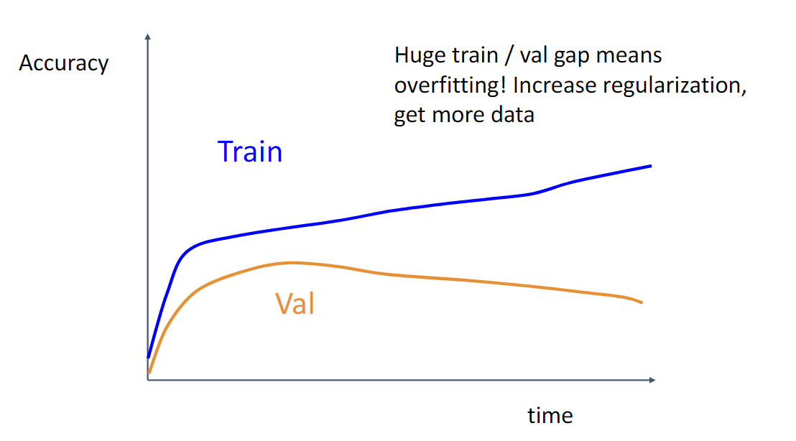
过拟合了，尝试增大正则化参数，收集更大的数据集或者减小模型的复杂度

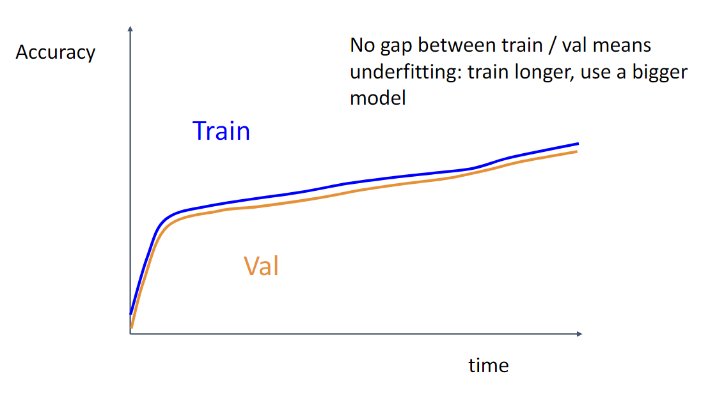
拟合不到位，尝试增大模型的复杂度

推荐使用 tensorboard

## model ensemble
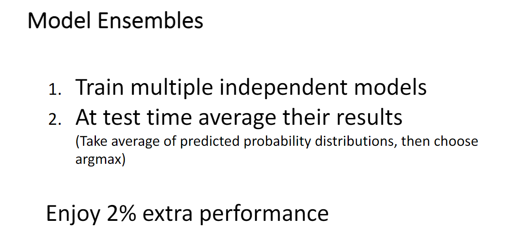
训练多个模型，然后取平均值

Polyak averaging：在训练的过程中，不断地更新平均模型，最后使用平均模型

如此图中的模型权重x，x_test指的是用于测试的模型权重，x_test是多个epoch中的平均

## transfer learning
使用已经训练好的模型，然后在此模型的基础上进行训练（比如把预训练模型的最后一层替换为我们自己的分类器，然后在我们自己的数据集上训练），此过程称为finetune（微调）

所以，一个好的预训练模型往往能够解决很多下游任务，比如在imageNet上训练好的模型往往能够解决很多图像分类、目标检测、语义分割问题

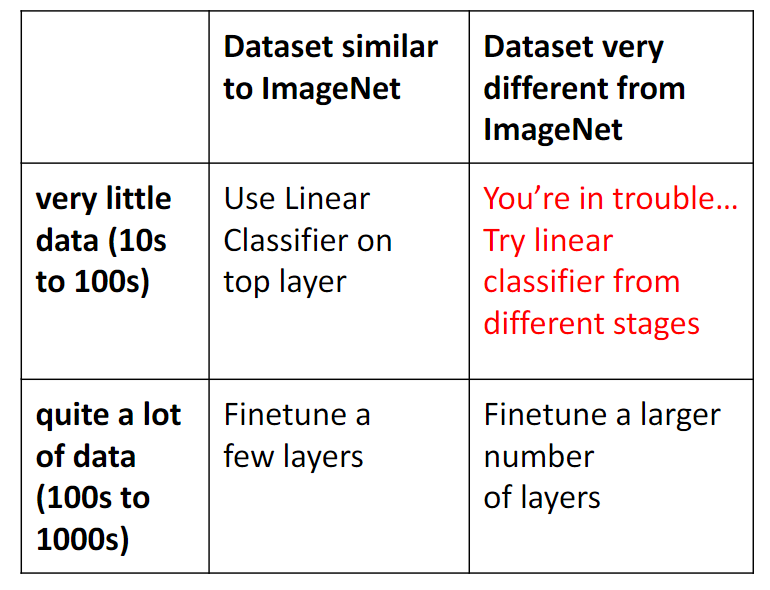

## distributed training
需要庞大数量的数据和计算资源

### 1
将模型拆分成多个部分，每个部分在一个gpu上训练，像一条流水线一样

缺点是浪费gpu资源，因为许多gpu往往处于等待状态

### 2
将模型中的某些部分建立许多分支，每个分支在不同的gpu上训练，最后取平均值

缺点是这样需要gpu之间的通信，往往是一件难办的事情；而且loss backward的时候也需要将梯度传递到所有gpu上

### 3
数据并行

每个gpu上都有一份模型，每个gpu上都有一份数据，然后每个gpu都进行训练，最后取平均值

这样训练是独立的，唯一需要通信的时刻是loss backward的时候，需要交流梯度

## large batch training
假设我们能在一个小数据集上训练出一个比较好的模型，那么我们如何使用更多的gpu，如何调整训练的参数呢（如果用原来的参数会花费大量时间）？
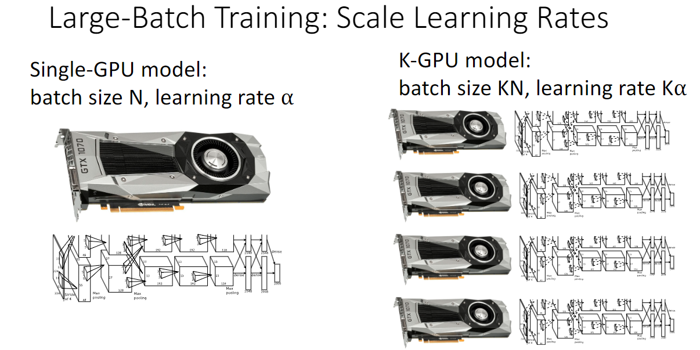
使用更大的batch size，提高学习率

### learning rate warmup
过大的学习率可能会导致梯度爆炸

可以使用warmup，即在训练的开始阶段，使用一个较小的学习率，然后逐渐增大学习率，比如线性增大

# L12
## RNN
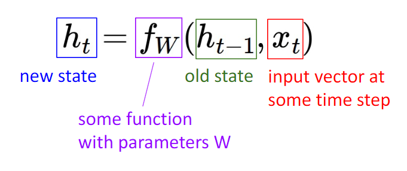

在序列任务中，需要保留历史信息，所以需要将历史信息前向传递，所以有了RNN，循环神经网络

每个新的state会统合所有历史信息

### 序列to多个label任务
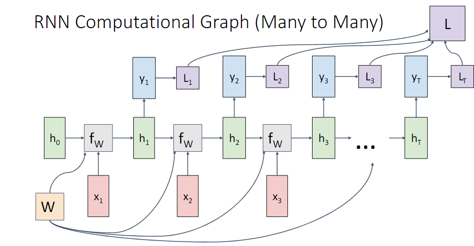

### 序列to单个label任务
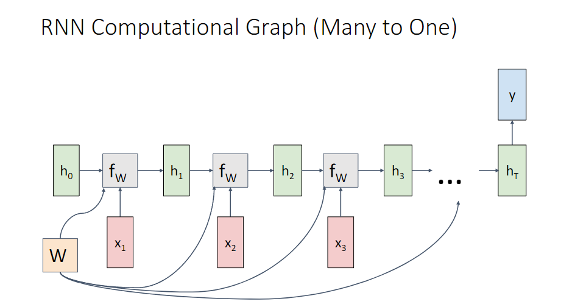

### 单个输入to序列任务
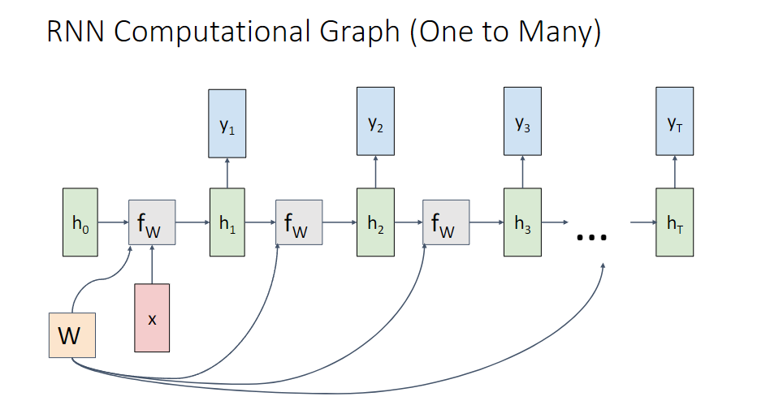

### 序列to序列任务
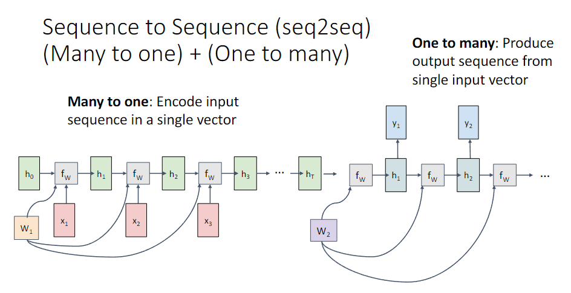

= many to one(encoder) + one to many(decoder)

## example: language modeling
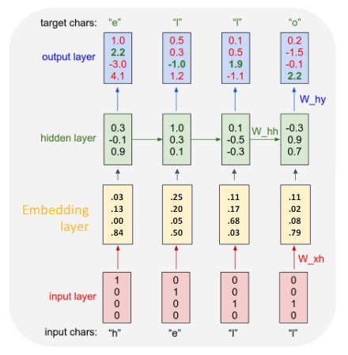
输入序列 ---> embedding layer ---> encode(many to one) ---> 特征向量 ---> RNN ---> 逐步预测单个单词/字符 ---> 输出序列

### backpropagation through time
在前向传播过程中，如果输入序列特别长，那么：
- 梯度可能会爆炸/消失
- 计算代价很大，消耗大量内存

解决：
- 截断梯度：只保留一定长度的梯度：比如取截断长度为10，那么每10个token计算总的loss，然后反向传播，计算梯度下降，更新权重，然后再取下一个10个token，计算梯度下降，只用于更新这次取的10个token的权重，如此循环

## RNN的强大之处和可解释性
实现任意的文本生成，甚至可以用它来生成代码

可解释性：

在一篇论文的研究中，对于生成代码的模型，提取了每一层的hidden layer，观察生成序列在相同维度上的信息，从-1到1用颜色标记，发现了一些有趣的结果：

比如一个高维的隐藏层特征向量，它的某一维度作用是判断是否在引号内
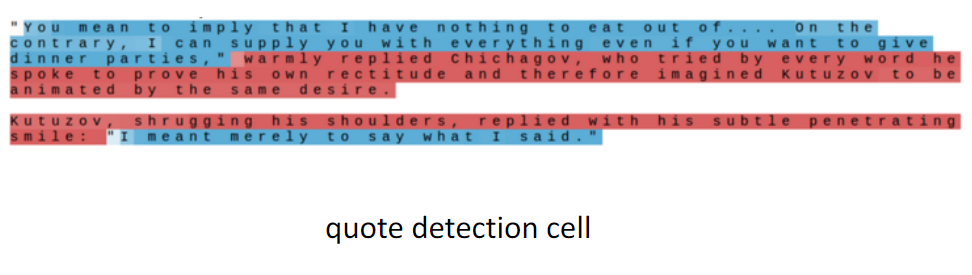

某一维度包含句子长度的信息，用于判断是否要加回车
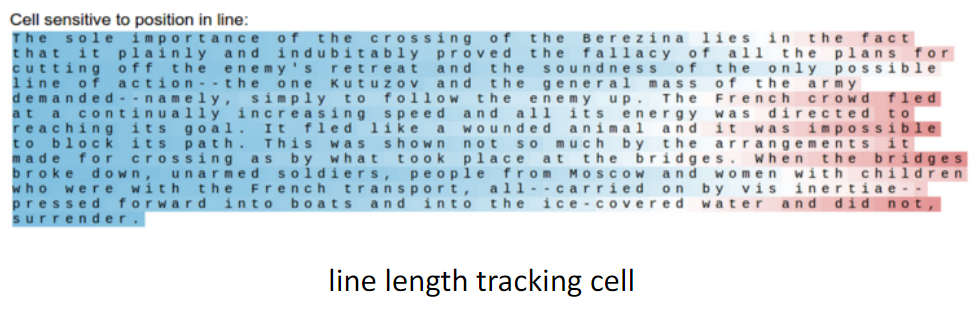

是否是if语句
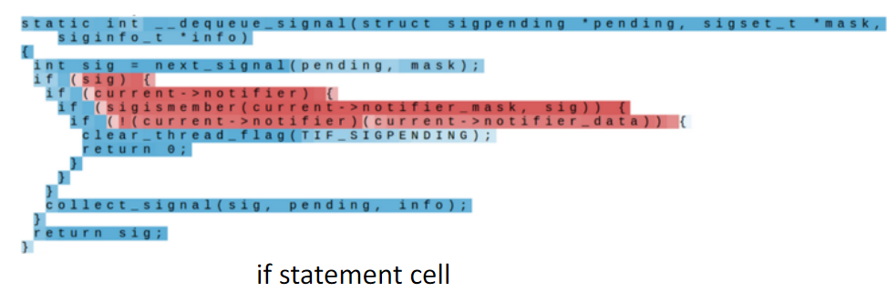

代码深度，判断要加多少个缩进
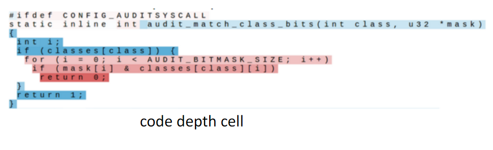

## 图像生成文字
在RNN的基础上，加上CNN，可以实现图像生成文字

CNN提取图像的特征，在hidden layer的公式中加上一项CNN提取的特征，然后再进行RNN的操作
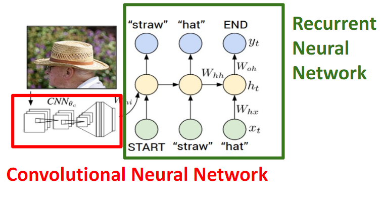

v为图像中提取的特征，Wih为其权重
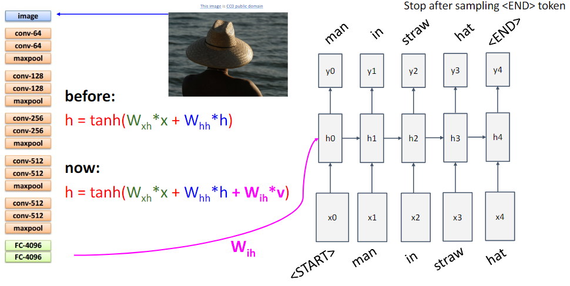

## 梯度消失和梯度爆炸
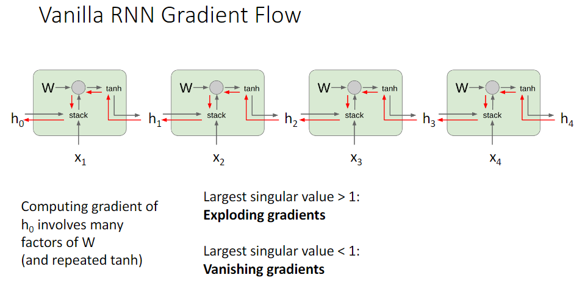
RNN在梯度传递的过程中，由于每次都要乘以权重矩阵的逆阵，最后会是权重矩阵的高次方，假设权重矩阵的特征值大于1，那么梯度就会爆炸；假设权重矩阵的特征值小于1，那么梯度就会消失

对于梯度爆炸的问题：

gradient clipping：梯度裁剪，当梯度的范数大于某个阈值的时候，就将梯度裁剪为这个阈值
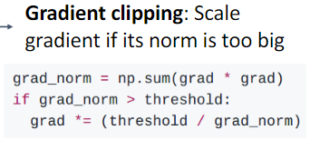

对于梯度消失的问题：

LSTM：
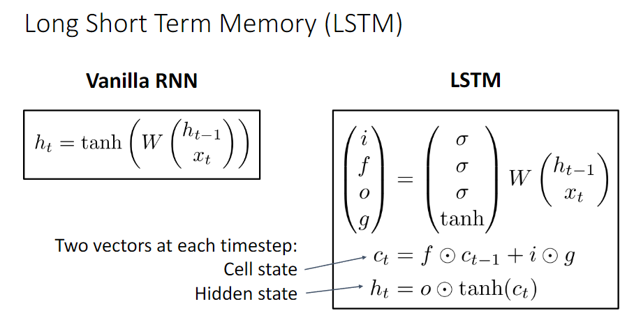
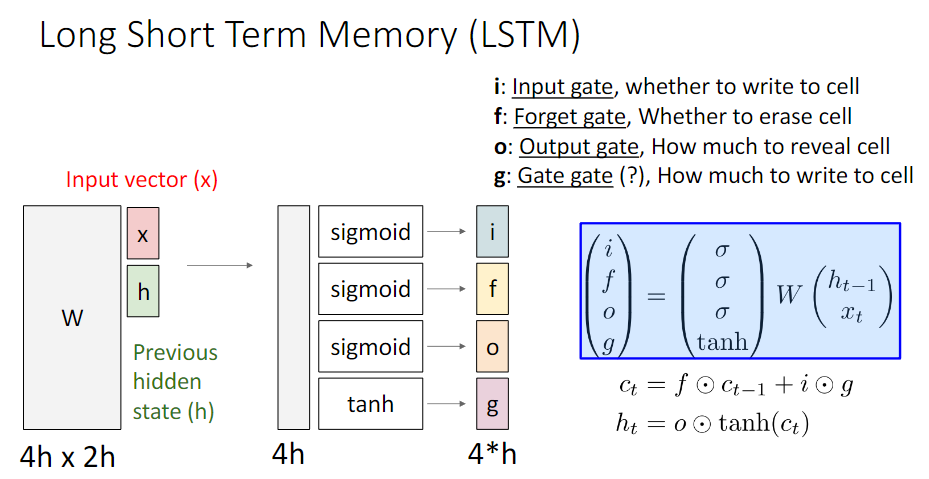

## RNN变种
multi-layer RNN
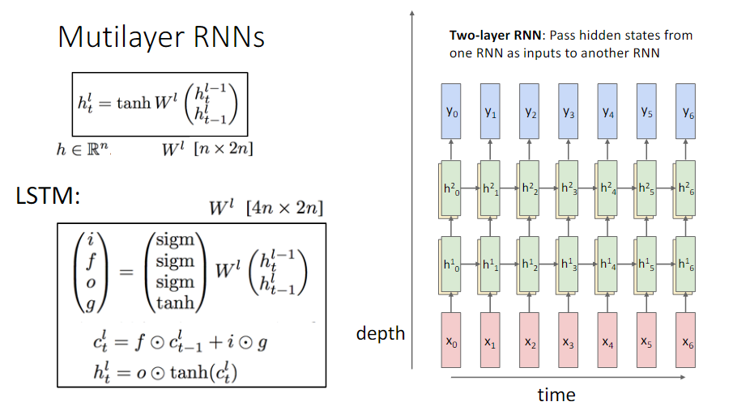


# L13
## 注意力机制
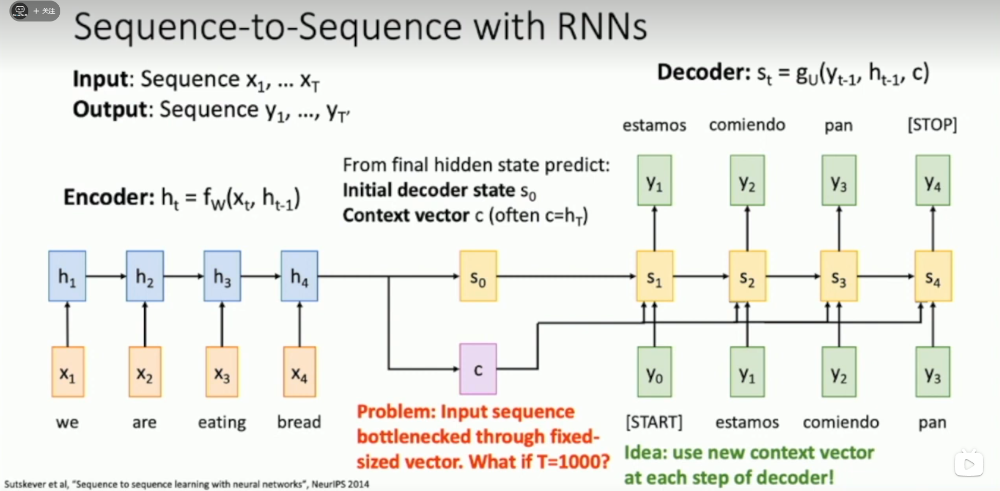
RNN处理文本翻译（sequence to sequence任务）结构：
前文特征c = encoder输出的隐藏层向量ht，状态特征s0也由ht得来，y0 = [start]，y0，s0，c输入decoder产生y1，s1，再将y1、s1、c输入decoder产生y2，s2，由此递推下去

问题：如果输入的文本序列过长，让c去统括这么长的特征信息是不合理的

解决：为decoder解码的每一步都生成一个c，且让decoder自己去选择应该关注输入序列的特征的哪一部分，这就是注意力机制

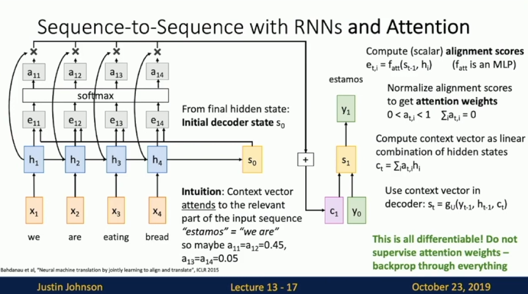
方法是给每一个隐藏层特征一个权重ei，将这些权重进行softmax，然后将这些权重和隐藏层特征相乘，得到一个加权的隐藏层特征，再将这些加权的隐藏层特征相加，得到一个c

权重高的特征，说明decoder在这一步应该重点关注这个特征；权重低的特征，说明decoder在这一步不太关心这个特征

权重ei的计算方法是将前一个状态特征st-1和输入序列对应的隐藏层特征使用mlp计算出ei

得到ct之后，st = f(st-1, yt-1, ct)

由于权重是mlp得出的，所以是让模型自己学习到根据当前状态特征应该关注输入序列的哪一部分

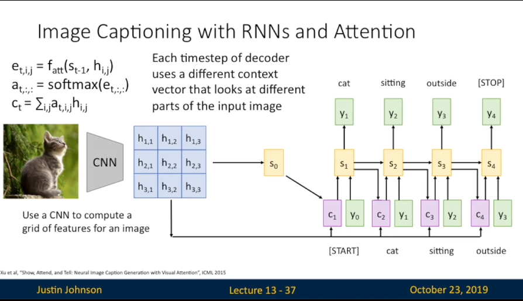
扩展：输入序列可以不是文本，而是其他形式的数据。
比如输入是一张图像，我们可以将图像分为多个网格，每个网格通过cnn提取隐藏层特征，然后通过注意力机制，让decoder自己选择应该关注图像的哪一部分，然后生成文本，这就是image captioning

## attention layer
q类比为decoder的隐藏层特征，x类比为encoder的隐藏层特征
### 单个q
query vector q(Dq)

input vector x(Nx * Dx)

similarity fuction(scaled dot product)：我们将q和xi的内积除以根号下Dq（q的维度），这么做的目的是为了让内积的值不会因为q的维度过大而导致内积的值过大，导致通过softmax之后有一个值接近1，其他值接近0，这样就会导致梯度消失（接近0的值对应的特征向量的梯度趋于0）

a dot b = |a| * |b| * cosθ
q dot xi = |q| * |xi| * cosθ
|q|不用归一化，因为每一项都有，所以不影响softmax的结果；但是|xi|不一样，所以我们要归一化：q * xi / sqrt(Dq)

similarity: ei = f(q, xi) = q * xi / sqrt(Dq)

attention weight: a = softmax(e)

### 多维q

query vector Q(Nq * Dq)

input vector X(Nx * Dx)

similarity function: E = f(Q, X) = Q * transpose(X) / sqrt(Dq)

attention weight: A = softmax(E,dim=1)

output: Y = A * X = sum(Ai * Xi)

### 区分key和value
- query vector Q(Nq * Dq)
- input vector X(Nx * Dx)
- key matrix Wk(Dx * Dq)
- value matrix Wv(Dx * Dv)

目的是给模型更加多的如何使用input vector的选择性：即对于每一个input vector，我们可以提取其中的部分信息与query vector进行对比，而不是全部信息，剩余的关键信息可以通过value matrix提供；
拿信息检索系统举例，query vector是用户输入的问题，input vector是文档，key matrix是文档的关键词，value matrix是文档的内容；我们不期望将文档的所有内容都与用户的问题进行对比，而是只提取文档的关键词与用户的问题进行对比，然后将文档的内容提供给用户

- key vector K = X * Wk
- value vector V = X * Wv
- similarity function: E = Q * transpose(K) / sqrt(Dq)
- attention weight: A = softmax(E,dim=1)
- output: Y = A * V = sum(Ai * Vi)：A广播到Nx * Dv，然后与V相乘

### self-attention layer
query vector Q由input vector X得到

- input vector X(Nx * Dx)
- key matrix Wk(Dx * Dq)
- value matrix Wv(Dx * Dv)
- query matrix Wq(Dx * Dq)

- key vector K(Nx * Dq) = X * Wk
- value vector V(Nx * Dv) = X * Wv
- query vector Q = X * Wq
- similarity function: E(Nx * Nx) = Q * transpose(K) / sqrt(Dq)
- attention weight: A(Nx) = softmax(E,dim=1)
- output: Y(Nx * Dv) = A * V = sum(Ai * Vi)

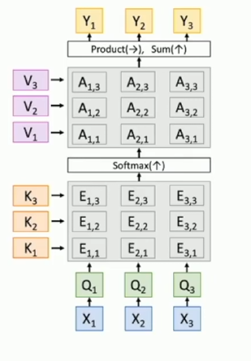
self-attention layer是置换等价的：即对于一个序列，我们可以将序列中的任意两个元素进行置换，然后通过self-attention layer仍然能够得到期望的结果；比如将input vector中每一行的顺序调换一下，然后通过self-attention layer，得到的output vector在每一行的顺序也是调换了的，但是每一行的内容是不变的，仍然是一一对应的：说明self-attention layer并不关心输入序列的顺序，只关心序列中的元素之间的关系！

所以当你需要模型去关心位置信息的时候，你需要加入位置编码

### masked self-attention layer
在训练的时候，我们不希望模型能够看到未来的信息，所以我们需要mask掉未来的信息
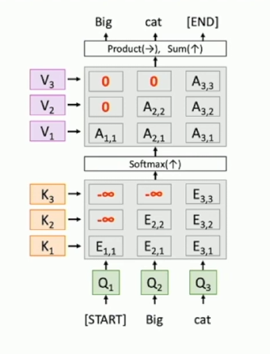
mask掉未来的信息，即将未来的信息的权重设置为负无穷，这样在softmax之后，未来的信息的权重就会变为0

### multi-head attention layer
number of heads H
将input vector分为H份，每一份都通过self-attention layer，然后将H份的output vector拼接在一起，得到最终的output vector

## examle: CNN + self-attention
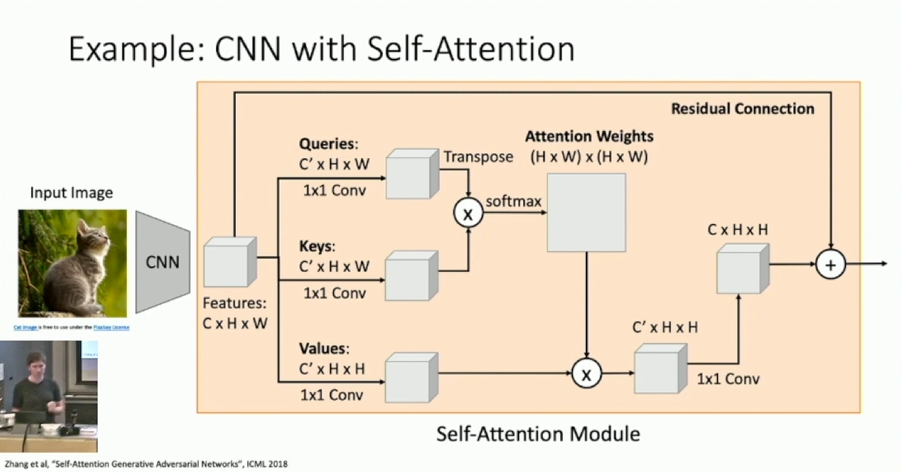
self-attention module

## 三种处理序列数据的方式
- RNN：逐步处理序列数据，每一步都会保留历史信息
  - 好处是可以处理任意长度的序列数据，RNN会记住所有历史信息
  - 坏处是计算代价大，且无法并行计算，梯度消失/爆炸
- 1D CNN：卷积处理序列数据，每一步都会保留局部信息
  - 好处是计算代价小，可以并行计算，梯度消失/爆炸问题不严重
  - 坏处是只能处理固定长度的序列数据，无法处理任意长度的序列数据，如果序列过长的话，CNN可能会丢失一些信息
- self-attention：每一步都会保留全局信息
  - 好处是可以处理任意长度的序列数据，且不会丢失信息，因为每一个output vector都统括了所有的input vector的信息；以及可以并行计算
  - 坏处是要进行多次大矩阵乘法，需要消耗大量内存
  - 但是self-attention的计算代价是可以接受的，因为我们可以使用GPU进行并行计算

## transformer
### transformer block
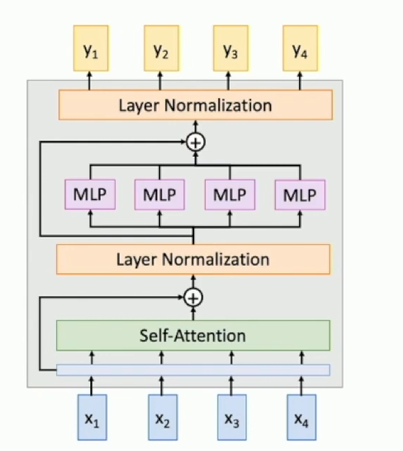
比较有趣的点是：layer normalization（normalize输入向量中不是batch的某个维度）和mlp都只是对输入序列各向量进行独立的运算，只有self-attention layer是对序列中的各个元素进行交互运算，所以是非常利于并行计算的
### transformer
transformer由多个transformer block组成
### 实际使用
可以使用大量文本数据来训练一个transformer模型，然后将这个模型应用于很多下游任务，比如文本分类、文本生成、文本翻译等等
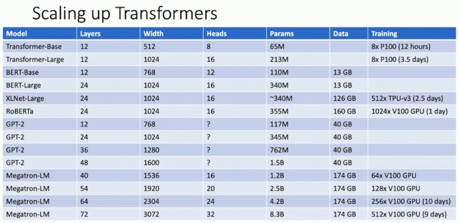

# L14
see what's going on in the network
## visualization
### 分类器的可视化
常用，分类器通常为一个hidden_dim * num_classes的矩阵，为每个类别输出一个预测分数

而输出的类别分数由通过分类器的高维特征向量 点积 分类器的某一行得到

点积的值越大，说明高维特征向量越接近分类器的某一行，那么可以说分类器的这一行就是将这个类别转换成特征向量，如果两个特征向量接近，就被分为一类

所以我们可以可视化分类器，看看每一个类别的特征向量是什么样的，从而理解分类器是如何工作的
### filter visualization
可视化卷积核

卷积核的可视化是通过将卷积核的权重矩阵转换为图像，然后显示出来；这样我们就可以大致了解卷积核是在检测什么样的特征，比如边缘、纹理、颜色等等

但随着网络的加深，卷积核的可视化就看不懂了，因为检测的特征变得更加抽象、隐晦

### 对分类器前一层得到的高维特征向量进行可视化
#### nearest neighbor
可以对这个特征向量使用nearest neighbor的方法，找到哪些图像的特征向量互相比较接近，那么它们就是相近的图像
#### 降维
使用PCA、t-SNE等方法将高维特征向量降维到2维，然后可视化

### activation visualization
可视化激活函数

可以可视化激活函数的输出，看看哪些神经元被激活了，从而了解网络是如何工作的

### maximally activating patches
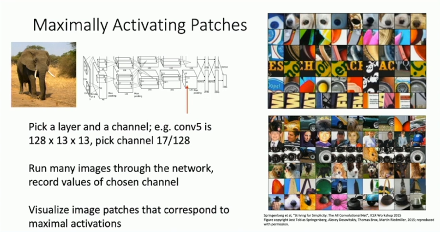
可以找到哪些patch能够最大激活某个神经元，从而了解这个神经元是如何工作的

比如输入很多张图片到网络中，看看某一层的某个channel的输出，看看哪些图片得到的是最大的输出，那么这些图片就是这个channel所关注的特征

### occlusion
遮蔽掉图像的某一部分，然后看看网络的输出有什么变化

比如在图像分类任务中，遮蔽掉图像的某一部分，然后这一类别的预测概率发生了什么变化

我们可以移动这个遮蔽的区域，扫描整张图片，输出一个热力图，描述的是各个区域像素点被遮蔽后得到的准确率，这样就可以知道哪些区域是网络关注的

这样也可以知道网络时候真的是在关注我们认为的特征，而不是关注了其他特征而恰巧分类正确

### backpropagation
可以通过反向传播，找到哪些像素点有最大的影响（因为梯度可以衡量改变一点输入的值，对输出产生多大的影响，梯度越大说明越重要）

我们可以查看反向传播到原始图像的梯度，进行可视化，看看哪些像素点有最大的影响

我们不仅可以查看原始图像对最终输出的影响，我们也可以选定某个特定的神经元，将这个神经元的梯度反向传播到原始图像，查看哪些像素点对这个神经元的激活有最大的影响

guided propagation：只保留正的梯度，将负的梯度置为0，这样可以更好地可视化（原因不清楚）；当然，通过relu的负值本身梯度就该被置为0

### gradient ascent
不是训练模型，而是固定已经训练好的模型的参数，训练“输入图像”，使得某个神经元的激活最大化，即最大化某个神经元的输出

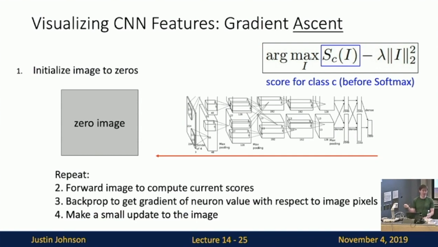
初始化一个zero image，然后通过梯度上升，改变输入图片，使得某个神经元的激活最大化

这样经过可视化之后，可以让我们了解模型关注的是何种图像特征

生成对抗样本：
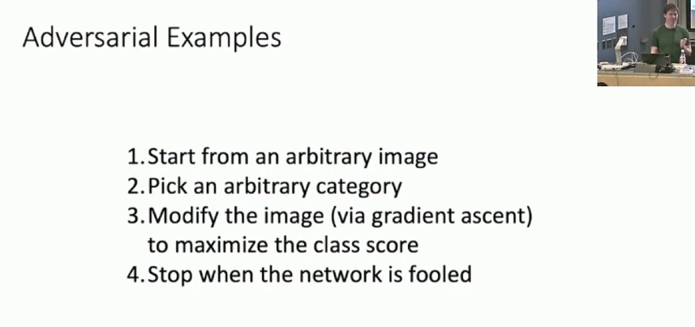
选择任意一张图像，选择任意一个不同的类别，然后通过梯度上升，改变输入图片，使得模型将这张图片分类为这一个不同的类别，就生成了对抗样本

### feature inversion
也使用gradient ascent的思想

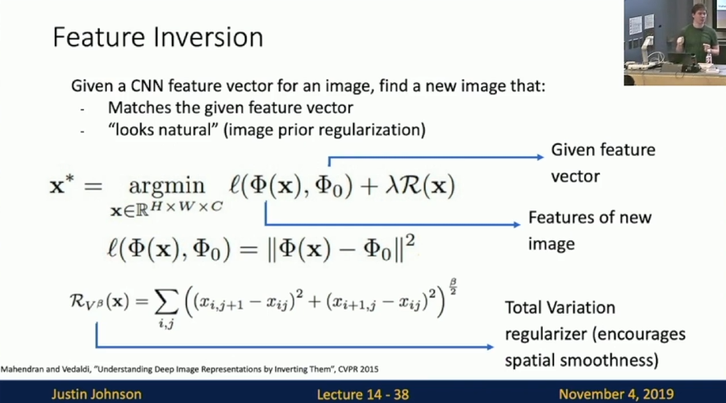
给定一个图像经过CNN之后的高维特征向量，训练另外一个图像，使得这个图像的高维特征向量与给定的高维特征向量尽可能接近，且看起来尽可能自然（通过正则化）

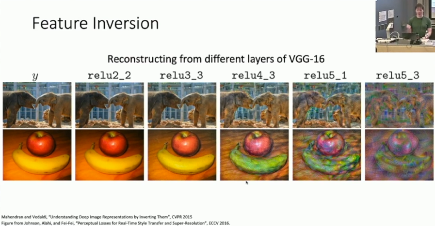
y为原始图像，之后的都是从头开始训练生成的图像，让它们和原始图像在relu之后特征向量尽可能接近

这样可以看出多层网络每一层提取了哪些特征

### deep dream
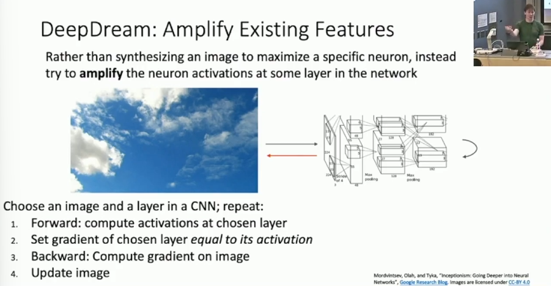
不是合成图像，而是对原始图像进行修改，使得网络某一层对原始图像的激活最大化

### texture synthesis
任务：输入一个小纹理，将其扩展成一张大的图像

gram matrix：提取图像的特征，而忽略其空间信息

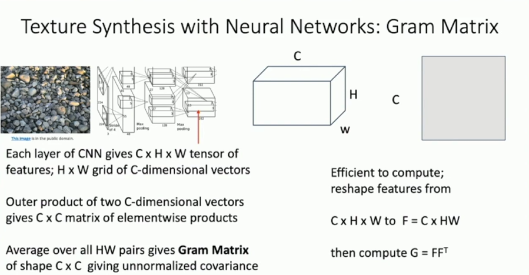
具体做法：
- 对于某一层的输出C * H * W，提取某一个channel的向量（即选择H = Hi，W = Wj，得到那一通道的向量），再提取其他通道的向量，将两个向量进行外积，得到一个C * C的矩阵
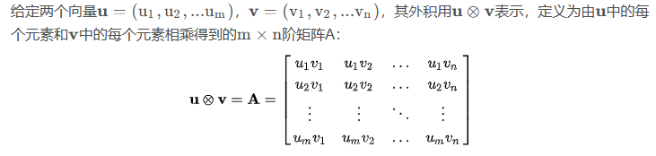
- 任取两个channel进行此操作，然后把所有得到的C * C矩阵取平均，得到一个C * C的矩阵，这个矩阵就是gram matrix

此gram matrix已经丢掉了所有的空间信息，只保留了通道之间的相关性

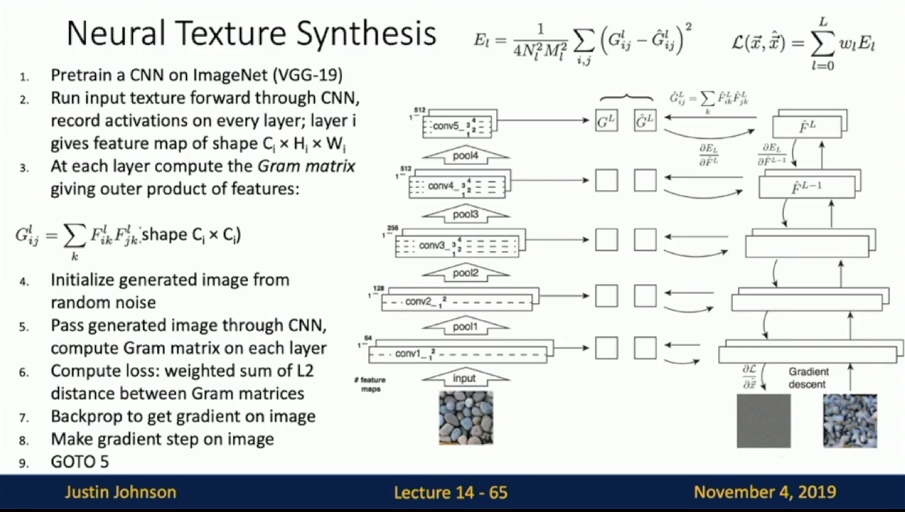
如何生成纹理：
- 预训练一个包含CNN的网络
- 对于输入纹理，生成一个gram matrix
- 生成一个随机的图像，然后提取gram matrix
- 训练此随机图像，使得此图像得到的gram matrix与输入纹理的gram matrix尽可能接近（设定loss为L2距离）
- 得到的图像就是我们想要的

### neural style transfer: feature inversion + texture synthesis
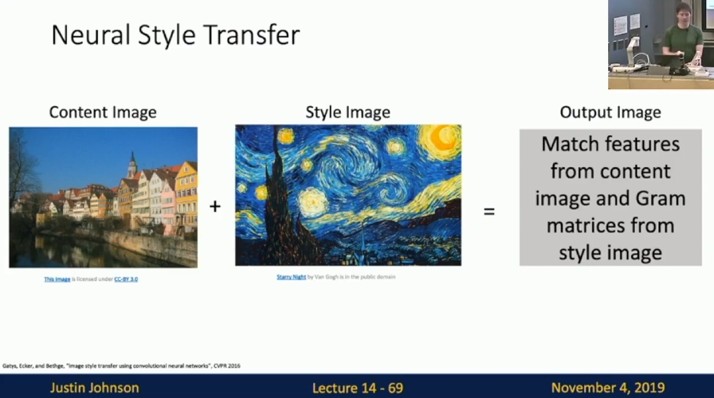
输出图像的高维特征向量与内容图像的高维特征向量尽可能接近，与风格图像的gram matrix尽可能接近

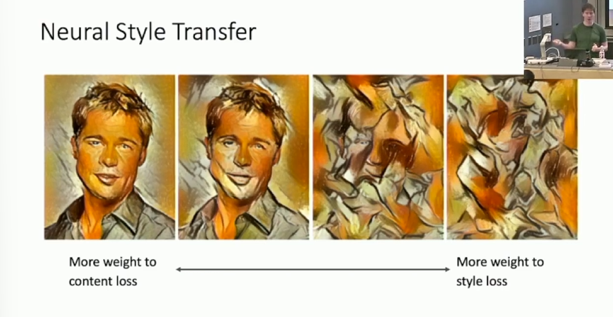
如果增加gram matrix的权重，那么图像的风格就会更加接近风格图像；如果增加内容图像的权重，那么图像的内容就会更加接近内容图像

multiple style images:
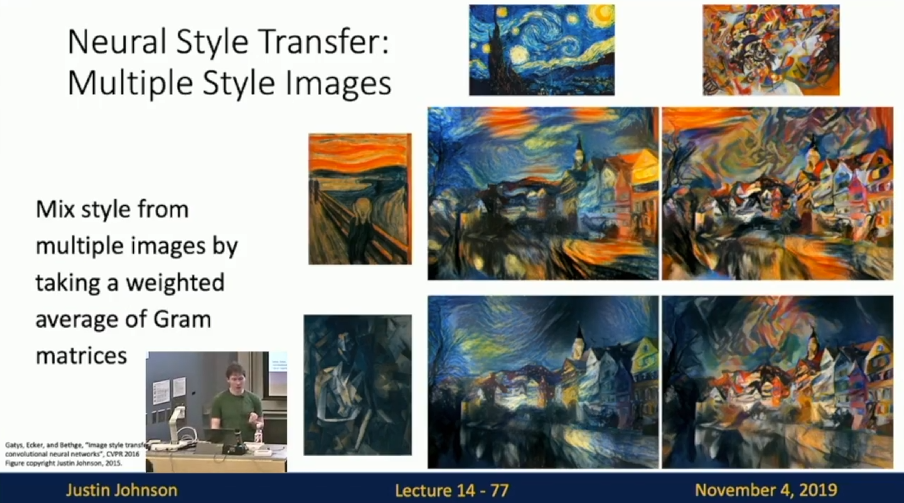

fast neural style transfer:
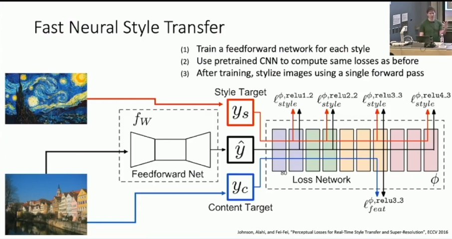

normalization in fast neural style transfer: instance normalization
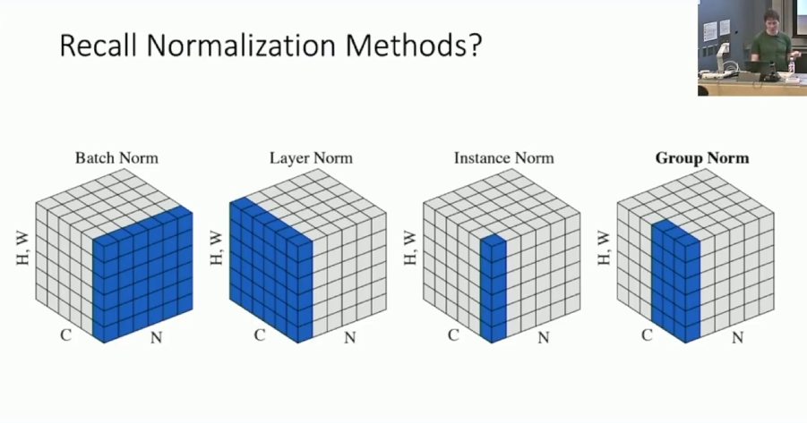

# L15
object detection

## 定义
input: rgb image

output:
- category label
- bounding box(x,y,width,height)

## 挑战
- 多个目标，需要把所有目标都检测出来
- 多个目标的类别可能不同
- 图片更大，分辨率更高

## detecting a single object
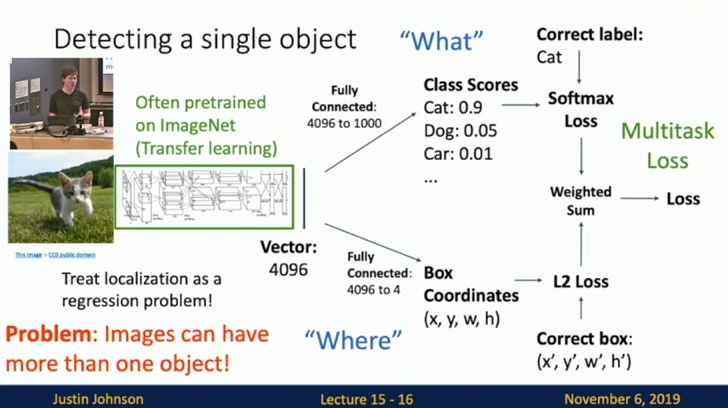
- category label: softmax loss
- bounding box: L2 loss between predicted bounding box and ground truth bounding box

final loss = λ1 * softmax loss + λ2 * L2 loss

## detecting multiple objects
### sliding window
将目标检测问题转化为分类问题，将图像切分为多个窗口，然后对每一个窗口进行分类；加入一个新的类别：背景

具体做法是：将图像切分为多个窗口，然后对每一个窗口进行分类；注意因为要考虑每个目标的大小不一样，而且可能重叠，所以窗口大小需要从1遍历到图片大小

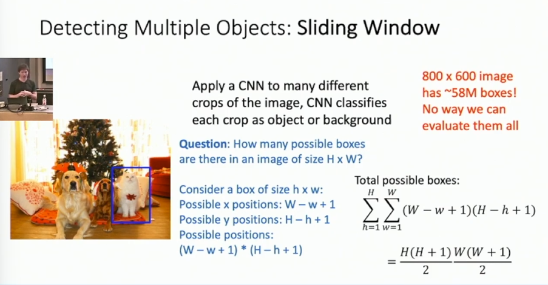
这就导致了计算代价很大

### region proposals
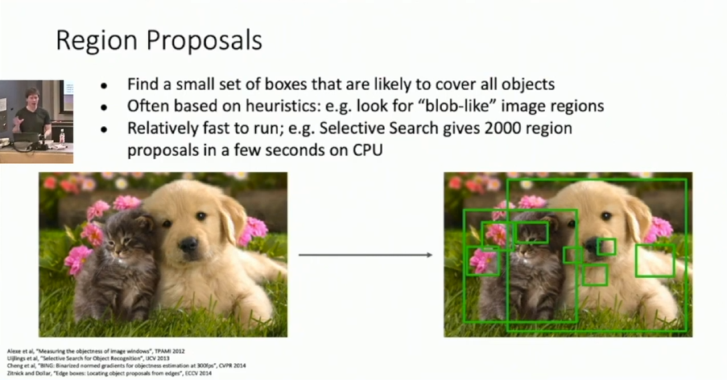

### R-CNN: Region-based Convolutional Neural Networks
#### train
- region proposals：使用selective search算法，生成2000个region proposals（候选区域）
- 将所有候选区域resize到相同大小
- 将所有候选区域输入到CNN中，得到特征向量
- 将特征向量输入到SVM中，得到分类结果
- bounding box regression：将特征向量输入到一个线性回归器中，得到bounding box，并不是直接输出bounding box，而是预测变换的参数，然后将这些参数应用到候选区域上，得到bounding box
- 根据分类结果和bounding box，计算loss
- 反向传播，更新CNN的权重（可选，其实可以选择已经在大数据集上预训练好的CNN）
- fine-tune：将CNN的权重固定，然后训练SVM和bounding box regression，这样即精修bounding box，让其更加准确
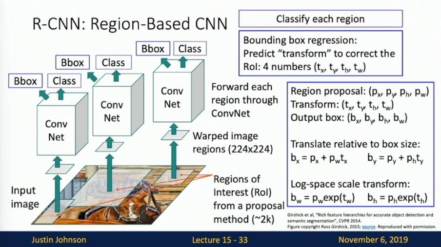

bounding box regression：
实际上输出的是4个变换值(tx,ty,tw,th)，bounding box是由这四个值变换得到的假设region proposal为(px,py,pw,ph)：
- bx = tx * pw + px
- by = ty * ph + py
- bw = pw * exp(tw)
- bh = ph * exp(th)

为何要这样做：因为这样我们的预测是无关于region proposal的位置信息的，而真实情况中图片左上角的物体和图片右下角的物体是一样的，所以CNN不应该去关心位置信息

> 图中的conv net是共享权重的，虽然画了很多个

#### test
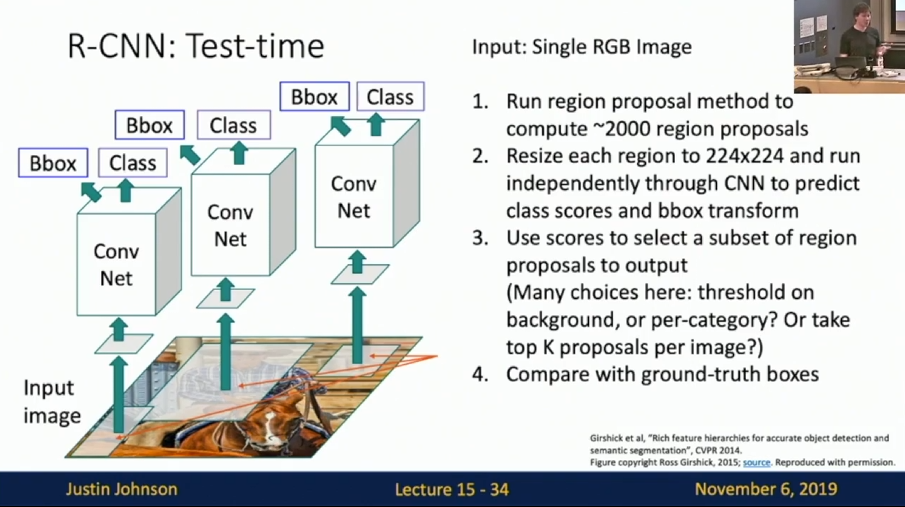

#### evaluate
IoU: intersection over union
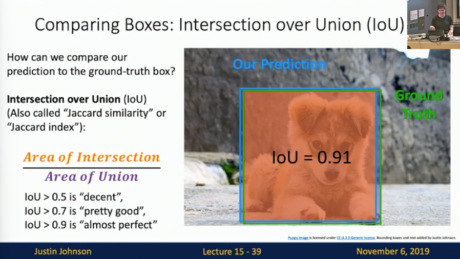

#### overlapping boxes
许多检测框重叠在一起

解决：
Non-Max Suppression：非极大值抑制
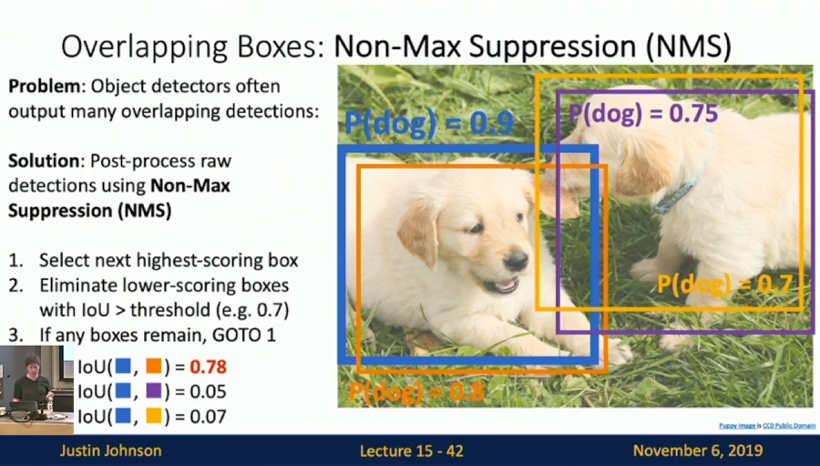
比如有多个检测框检测为狗（概率不同），我们将这些检测框根据概率排序，从最高概率的开始选取，计算这个检测框与其他低概率的检测框的IoU，如果IoU大于某个阈值，那么就删除低概率的检测框；然后继续选取下一个检测框，直到所有检测框都被处理

但问题是如果真的有很多物体确实是重叠在一起的，那么这种方法就会删除一些检测到的物体

### evaluate object detectors
mean average precision (mAP)
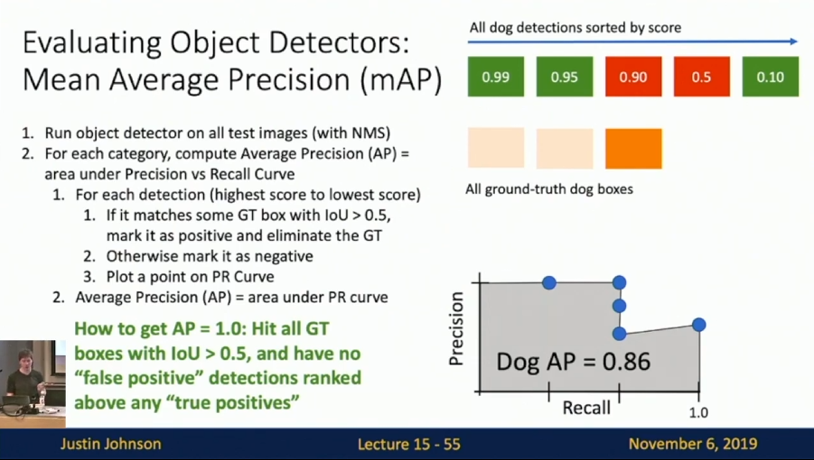

mAP@0.5：IoU > 0.5的检测框
mAP@0.75：IoU > 0.75的检测框
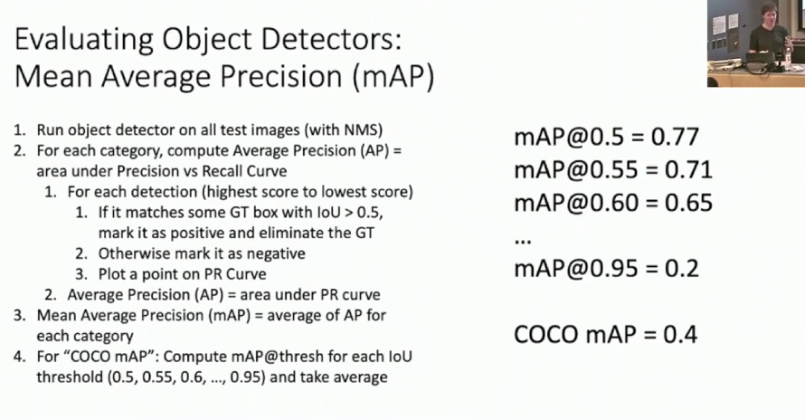

### fast R-CNN
backbone network：使用CNN提取特征的网络，通常是VGG16、ResNet、AlexNet等

将整张图片输入backbone network，得到feature map，然后根据region proposals，我们crop出我们关心的区域的特征（从feature map中），得到region features，然后经过一个per-region network（轻量级的，很快，可以是简单的mlp）得到分类结果和bounding box
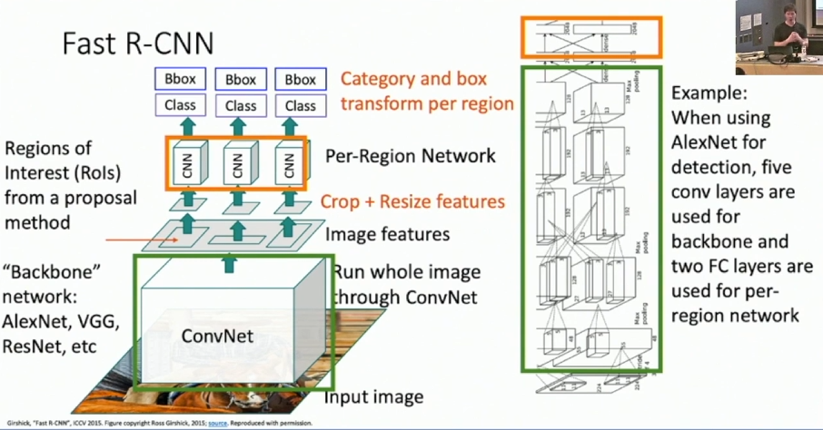

重点是非常耗时的CNN只需要运行一次，然后我们只需要crop出我们关心的区域的特征，然后经过一个轻量级的网络，就可以得到分类结果和bounding box

fast-RCNN的主要计算时间在于计算region proposals

#### cropping features: RoI pooling
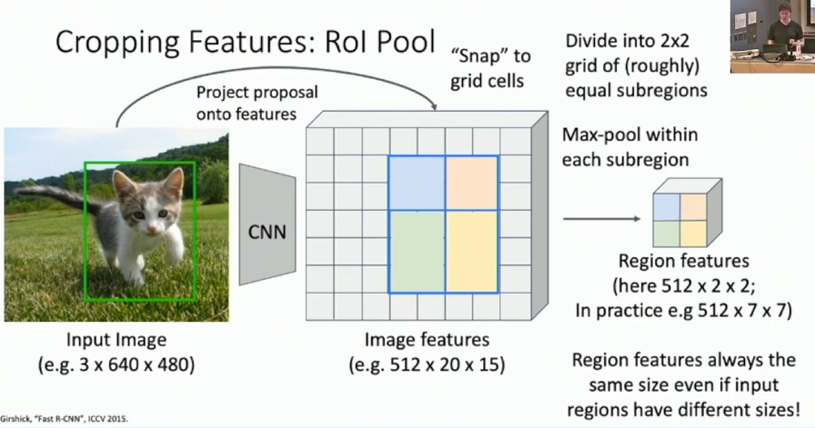
对于一张图片，我们将其经过一个CNN网络得到一张大的feature map，之后对于我们感兴趣的区域，根据CNN的运算规则，其同样映射到了feature map上，我们找到这个区域，将其划分为7 * 7的网格，然后对每一个网格进行max pooling，得到一个7 * 7的最终特征向量

这样的好处是无论我们感兴趣的区域大小是多少，我们都可以将其映射为7 * 7的特征向量，这样我们就可以将不同大小的区域输入到per-region network中

Rol align：使用线性插值
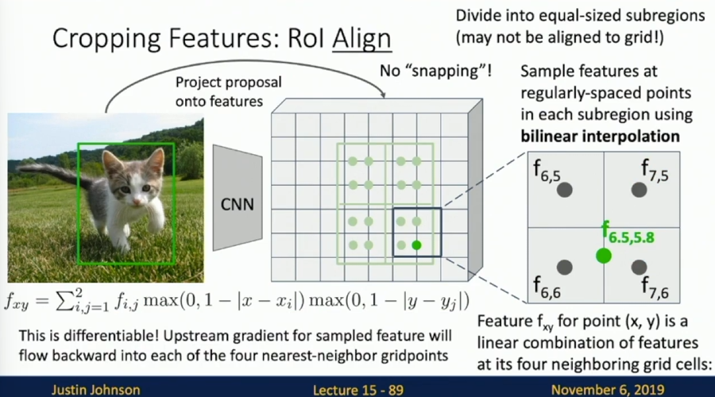

### faster R-CNN
使用RPN（region proposal network）来生成region proposals

#### RPN
anchor boxes：预定义的K个bounding box，比如大小为128 * 128，256 * 256，512 * 512等等，然后在图像的每一个像素点上都生成这些anchor boxes，然后对每一个anchor box，我们通过一个卷积操作预测它包含待检测物体（正例）还是不包含待检测物体（负例），会输出两个分数：正例的分数和负例的分数，再通过一个softmax计算概率；反向传播计算梯度的时候，将其当成一个二分类问题来处理，计算loss和梯度

对于每个anchor box，除了输出它的预测分数，我们还通过另外一个卷积操作输出它的bounding box的变换参数，即将anchor box变换为真实的bounding box的参数

在测试的时候，根据anchor box的预测分数，我们选择一些高分的anchor box（比如取前300个），然后根据bounding box的变换参数，将anchor box变换为真实的bounding box

> ps: 其实只输出一个预测分数使用logistic regression也可以，> 0 为正例，< 0 为负例

超参数：每点上anchor box的个数K，anchor box的大小和长宽比等等

### single-stage object detection
在faster R-CNN的基础上，将RPN和per-region network合并为一个网络，即直接输出分类结果和bounding box
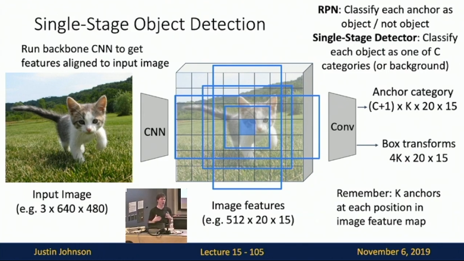
即对于预测正例还是负例的卷积操作，我们扩展一下，直接输出C+1个类别（包含背景类别）的预测分数，这样我们就可以不需要per-region network了，相当于把region proposals和分类&检测网络合并了

YOLO：You Only Look Once

当然，虽然这样做会减少计算代价，但是准确率不如two-stage object detection

### FPN: Feature Pyramid Network
为了解决多尺度的问题，即有些物体很大，包含很多像素点，但也有些物体很小，只包含很少的像素点，而在faster R-CNN中，我们只使用了最后一层的feature map，这样可能会导致小物体的信息丢失（比如我们得到的特征图是60 * 60，而原图是600 * 600，那么特征图上一个像素点对应原图上的10 * 10的像素点，那么原图上可能有许多小于10 * 10像素点的物体，它们的信息就容易丢失，或说至少位置信息容易丢失）

为了处理这种多尺度物体检测的问题，一种方法是：featurized image pyramid。这种方式就是先把图片弄成不同尺寸的，然后再对每种尺寸的图片提取不同尺度的特征，再对每个尺度的特征都进行单独的预测，这种方式的优点是不同尺度的特征都可以包含很丰富的语义信息，但是缺点就是时间成本太高。

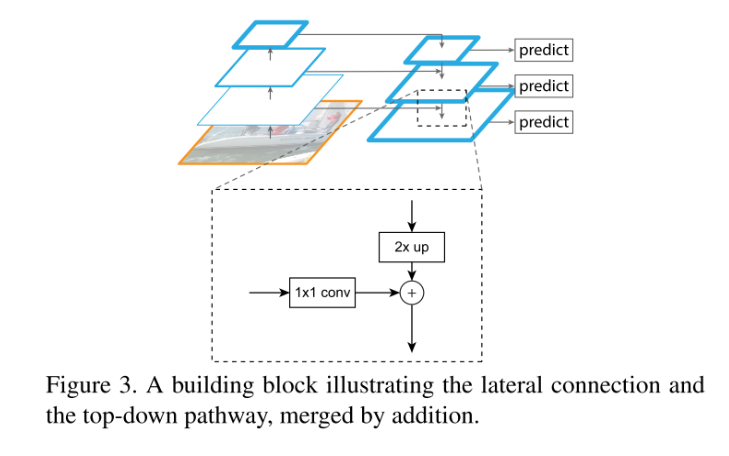
另一种更好的方法是：Feature Pyramid Network（FPN）。FPN的思想是：利用CNN的特征金字塔，即CNN的不同层的feature map，然后将这些feature map进行融合，得到一个更加丰富的特征金字塔，然后再对每一层进行预测。

底层特征往往包含物体的位置信息，高层特征往往包含物体的语义信息，所以我们可以将高层特征和底层特征进行融合，让识别和定位都更加准确

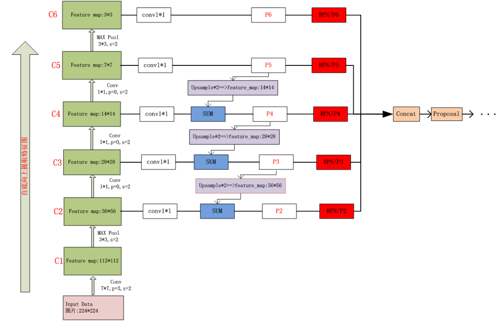
网络主要分为两部分：
- bottom-up：即自底向上进行cnn得到特征图的过程
- top-down：对高层特征图进行上采样（越高层的特征图往往越小），通常的方法是最近邻插值法，使得高层特征图的大小和低层特征图的大小一样
- 1 * 1 convolution：对特征图进行1 * 1的卷积操作，使得其通道数互相一致
- lateral connections：将高层特征图和底层特征图进行融合，通常是简单的逐元素相加，得到一个更加丰富的特征图
- 3 * 3 convolution：对融合后的特征图进行3 * 3的卷积操作，得到最终的特征图


